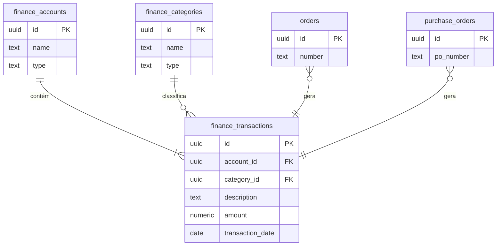
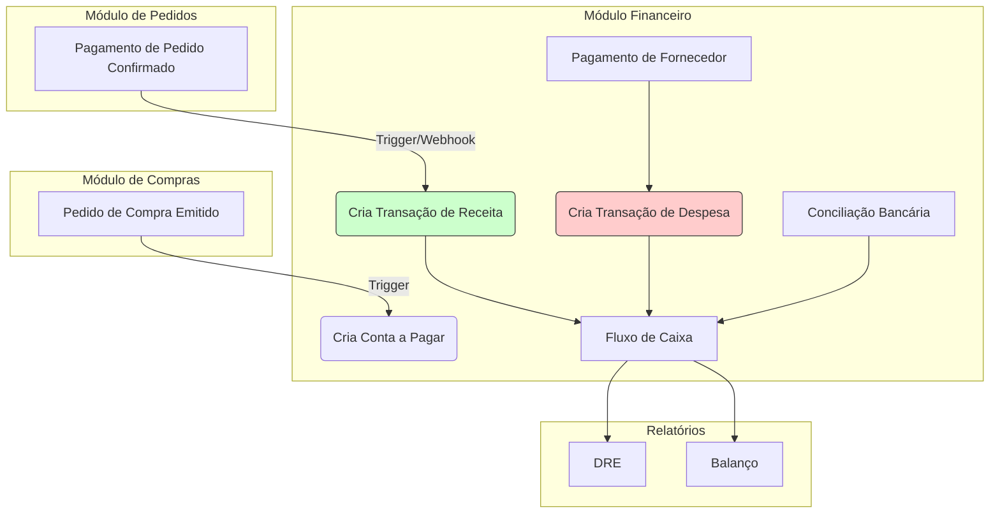

# Documentação Técnica do Módulo: Financeiro (Finance) v2.0

**Versão:** 2.0 (Arquitetura Base)
**Data:** 2024-07-31
**Responsável:** 🧠 ArquitetoSupremo (Crew-Gemini)
**Arquivo Fonte:** `/reports/finance_v2_diff.md`

---

## 1. Visão Geral

O Módulo Financeiro é o centro de controle monetário do Olie Hub. Sua responsabilidade é consolidar todas as transações financeiras da empresa, fornecendo uma visão clara do fluxo de caixa, contas a pagar, contas a receber e lucratividade. Ele se integra diretamente aos módulos de Pedidos (receitas) e Compras (despesas) para automatizar a escrituração e garantir a precisão dos dados.

-   **Objetivo Operacional:** Rastrear cada real que entra e sai da empresa, automatizar a conciliação, gerar relatórios de DRE (Demonstração do Resultado do Exercício) e apoiar a tomada de decisão estratégica com dados financeiros confiáveis.
-   **Papéis Envolvidos:**
    -   `Financeiro`: Gestão de transações, conciliação bancária, aprovação de pagamentos.
    -   `AdminGeral`: Acesso total para supervisão, análise de relatórios e planejamento financeiro.

---

## 2. Estrutura de Dados

A arquitetura de dados proposta para a v2.0 é baseada em um sistema de "double-entry bookkeeping" simplificado, com foco na rastreabilidade e categorização de todas as transações. **Nenhuma das tabelas a seguir existe no schema atual do sandbox; elas representam a arquitetura planejada.**

### Tabelas Planejadas

| Tabela | Descrição |
| :--- | :--- |
| `finance_accounts` | Cadastro de contas financeiras (bancos, caixa, cartões). |
| `finance_categories`| Plano de contas (ex: 'Receita de Vendas', 'Custo de Material'). |
| `finance_transactions`| O ledger principal, registrando cada transação única. |
| `finance_payables` | Controle de contas a pagar, gerado a partir de Pedidos de Compra. |
| `finance_receivables`| Controle de contas a receber, gerado a partir de Pedidos de Venda. |

### Campos-Chave Propostos

#### `finance_transactions`
| Coluna | Tipo | Descrição |
| :--- | :--- | :--- |
| `id` | `uuid` | Chave primária. |
| `account_id`| `uuid` | FK para `finance_accounts.id`. |
| `category_id`| `uuid` | FK para `finance_categories.id`. |
| `description`| `text` | Descrição da transação. |
| `amount` | `numeric` | Valor da transação (positivo para receitas, negativo para despesas). |
| `transaction_date`| `date` | Data de competência da transação. |
| `reference_id`| `uuid` | ID da entidade de origem (ex: `order_id`, `purchase_order_id`). |
| `status` | `text` | Status (ex: 'pending', 'cleared', 'cancelled'). |

### Diagrama de Relacionamento (ERD) Proposto

---

## 3. Regras de Negócio & RLS (Propostos)

### Políticas de Acesso (RLS)
| Papel | Permissões em `finance_*` |
| :--- | :--- | :--- |
| `AdminGeral` | CRUD completo. |
| `Financeiro` | `SELECT`, `INSERT`, `UPDATE`. |
| Outros | Acesso restrito ou `SELECT` apenas a dados relacionados. |

### Triggers (Recomendados)
- **`create_receivable_from_order` (CRÍTICO):** Um trigger que, ao criar um `order`, gera um registro correspondente em `finance_receivables`. Quando o pagamento do pedido é confirmado, ele cria a transação de entrada em `finance_transactions`.
- **`create_payable_from_po` (CRÍTICO):** Um trigger que, ao mover uma `purchase_order` para o status `issued`, gera um registro correspondente em `finance_payables`.
- **`prevent_unbalanced_transactions`**: Garante que as transações sigam as regras contábeis básicas.

---

## 4. Fluxos Operacionais

O Módulo Financeiro é alimentado por eventos dos módulos operacionais.

---

## 5. KPIs & Métricas

| KPI | Descrição |
| :--- | :--- |
| **Lucro Líquido** | Receitas - Despesas. |
| **Fluxo de Caixa Operacional** | Dinheiro gerado pelas operações principais. |
| **Prazo Médio de Recebimento (PMR)** | Tempo médio para receber dos clientes. |
| **Prazo Médio de Pagamento (PMP)** | Tempo médio para pagar os fornecedores. |
| **Margem de Lucro Bruta** | (Receita - Custo dos Produtos Vendidos) / Receita. |

---

## 6. Critérios de Aceite

-   [ ] **Pendente:** As tabelas `finance_accounts`, `finance_categories`, e `finance_transactions` existem no banco de dados.
-   [ ] **Pendente:** A confirmação de pagamento de um pedido gera uma transação de receita.
-   [ ] **Pendente:** A emissão de um pedido de compra gera uma conta a pagar.
-   [ ] **Pendente:** A UI permite a visualização do extrato por conta (`finance_transactions`).
-   [ ] **Pendente:** A UI permite a criação manual de transações (ex: despesas administrativas).

---

## 7. Auditoria Técnica (Diff) - Implantação v2.0

Esta documentação representa a **primeira versão formal (v2.0)** da arquitetura do Módulo Financeiro. Nenhuma implementação anterior existia no código-fonte ou no banco de dados.

-   **Análise do Sandbox:** A auditoria confirmou a **ausência total** de tabelas com o prefixo `finance_*` no schema do sandbox (`exports/schema.json`) e nos mocks (`services/sandboxDb.ts`).
-   **Definição da Arquitetura:** A v2.0 estabelece o blueprint para o desenvolvimento. A arquitetura de ledger com `finance_transactions` foi escolhida por sua robustez, escalabilidade e capacidade de auditoria, que são requisitos fundamentais para um módulo financeiro.
-   **Estratégia de Implementação:** O documento serve como guia para a equipe de banco de dados criar as migrações necessárias. A implementação do frontend (hooks e componentes) deve ocorrer somente após a criação do schema base.

---

## 8. Ações Recomendadas / Pendentes

1.  **[CRÍTICO] Criar Schema do Banco de Dados:** A prioridade máxima é criar as tabelas propostas (`finance_accounts`, `finance_categories`, `finance_transactions`, etc.) no Supabase de produção.
2.  **[ALTA] Implementar Triggers de Integração:** Desenvolver e aplicar os triggers `create_receivable_from_order` e `create_payable_from_po` para automatizar a captura de eventos dos módulos de Pedidos e Compras.
3.  **[MÉDIA] Desenvolver a UI Base:** Criar o hook `useFinance` e os componentes básicos para a visualização do extrato de transações.
4.  **[BAIXA] Desenvolver Relatórios:** Após a implementação da base, desenvolver os relatórios de DRE e Fluxo de Caixa.