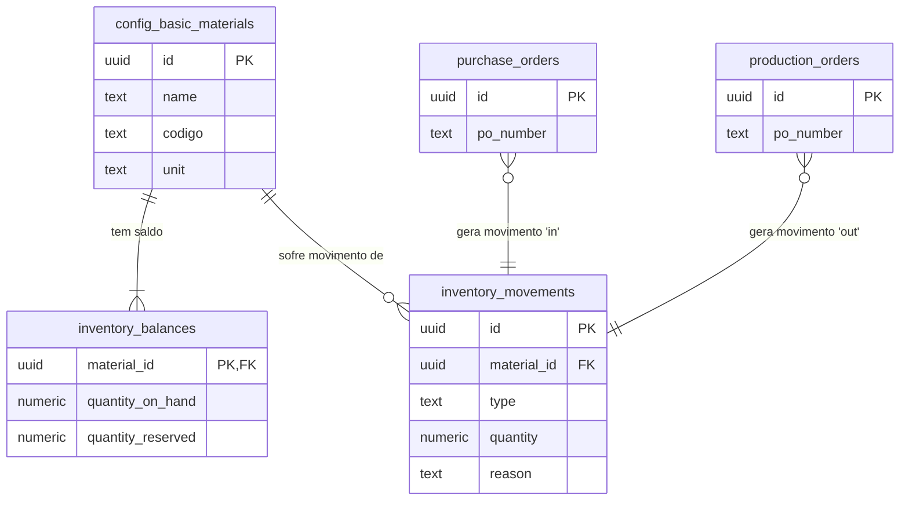

# Documentação Técnica do Módulo: Estoque (Inventory) v2.5

**Versão:** 2.5 (Evolução para Ledger System)
**Data:** 2024-07-31
**Responsável:** 🧠 ArquitetoSupremo (Crew-Gemini)
**Arquivo Fonte:** `/reports/inventory_v2_5_diff.md`

---

## 1. Visão Geral

O Módulo de Estoque é o pilar de controle de ativos do Olie Hub. Sua função principal é fornecer uma visão precisa e em tempo real dos níveis de todos os materiais básicos, desde tecidos e zíperes até linhas e embalagens. Ele opera como um sistema de ledger, registrando cada entrada, saída e ajuste, o que garante total rastreabilidade e auditoria. Este módulo é essencial para alimentar os processos de Compra (sinalizando necessidade de reposição) e Produção (reservando e consumindo materiais).

-   **Objetivo Operacional:** Manter a acuracidade do inventário, prevenir rupturas de estoque, fornecer dados para o planejamento de compras e garantir que a produção tenha os insumos necessários disponíveis.
-   **Papéis Envolvidos:**
    -   `Producao`: Consulta saldos, consome materiais para Ordens de Produção.
    -   `Financeiro`/`AdminGeral`: Realiza ajustes de inventário, audita movimentações, analisa valor de estoque.

---

## 2. Estrutura de Dados

A arquitetura de dados da v2.5 abandona o modelo simplista de um único campo de quantidade para adotar um sistema de ledger robusto, composto por saldos e movimentações.

### Tabelas Principais (Schema Ativo no Sandbox)

| Tabela | Descrição |
| :--- | :--- |
| `inventory_balances` | Tabela de "estado atual". Armazena o saldo consolidado de cada material. **Atualmente não existe no schema de produção.** |
| `inventory_movements` | Tabela de "log". Registra cada transação de estoque (entrada, saída, ajuste). |
| `config_basic_materials`| Catálogo mestre de todos os materiais que podem ter estoque. |

### Campos-Chave

#### `inventory_balances`
| Coluna | Tipo | Descrição |
| :--- | :--- | :--- |
| `material_id` | `uuid` | Chave primária e estrangeira para `config_basic_materials.id`. |
| `quantity_on_hand`| `numeric`| Saldo físico total no estoque. |
| `quantity_reserved`| `numeric`| Quantidade comprometida para Ordens de Produção em andamento. |
| `low_stock_threshold`| `numeric`| Limite para alertas de estoque baixo. |

#### `inventory_movements`
| Coluna | Tipo | Descrição |
| :--- | :--- | :--- |
| `id` | `uuid` | Chave primária. |
| `material_id` | `uuid` | Chave estrangeira para `config_basic_materials.id`. |
| `type` | `text` | Tipo de movimento: 'in', 'out', 'adjustment'. |
| `quantity` | `numeric` | Quantidade movimentada (positiva para 'in', negativa para 'out'). |
| `reason` | `text` | Motivo da movimentação (ex: 'compra', 'consumo_producao'). |
| `reference_id`| `uuid` | ID da entidade relacionada (ex: `purchase_order_id`, `production_order_id`). |

### Diagrama de Relacionamento (ERD)



---

## 3. Regras de Negócio & RLS

### Políticas de Acesso (RLS)
| Papel | Permissões em `inventory_movements` | Permissões em `inventory_balances` |
| :--- | :--- | :--- |
| `AdminGeral` | CRUD completo. | CRUD completo (para ajustes iniciais). |
| `Producao` | `INSERT` (apenas `type='out'`, `reason='consumo_producao'`), `SELECT`. | `SELECT` (somente leitura). |
| `Financeiro` | `INSERT` (apenas `type='in'`, `reason='compra'`), `SELECT`. | `SELECT` (somente leitura). |

### Lógica Central
A disponibilidade de um material é calculada, não armazenada:
**`Saldo Disponível = quantity_on_hand - quantity_reserved`**

### Triggers (Recomendados)
- **`update_inventory_balance_from_movement` (CRÍTICO):** Um trigger a ser implementado no banco de dados que, na inserção de um novo registro em `inventory_movements`, atualiza atomicamente a linha correspondente em `inventory_balances`. Isso garante a consistência e integridade dos dados, removendo a responsabilidade da aplicação.
  - Se `type = 'in'`, `quantity_on_hand` aumenta.
  - Se `type = 'out'`, `quantity_on_hand` diminui.
  - Se `type = 'adjustment'`, `quantity_on_hand` é definido para o novo valor.

---

## 4. Fluxos Operacionais

O estoque é atualizado em resposta a eventos de outros módulos.

```mermaid
graph TD
    subgraph Módulo de Compras
        A[Recebimento de PO] --> B(Cria Movimento 'in');
    end

    subgraph Módulo de Produção
        D[OP Inicia] --> E{Reserva de Estoque};
        E --"Atualiza 'quantity_reserved'"--> F[Saldo Disponível Diminui];
        G[Consumo de Material] --> H(Cria Movimento 'out');
    end
    
    subgraph Módulo de Estoque (DB)
        B --"Trigger"--> C[Atualiza 'quantity_on_hand'];
        H --"Trigger"--> I[Atualiza 'quantity_on_hand' e 'quantity_reserved'];
    end
    
    subgraph Módulo de Vendas
        J[Pedido de Venda Aprovado] --> D;
    end
```

---

## 5. KPIs & Métricas

| KPI | Descrição | Meta |
| :--- | :--- | :--- |
| **Giro de Estoque (Stock Turn)** | Quantas vezes o estoque é vendido/consumido e reposto em um período. | > 6 por ano |
| **Acuracidade do Inventário** | % de correspondência entre o saldo do sistema e a contagem física. | > 99% |
| **Taxa de Ruptura (Stockout Rate)** | % de vezes que um material necessário para produção não estava disponível. | < 1% |
| **Valor do Estoque (Inventory Value)** | Custo total dos materiais em `quantity_on_hand`. | Monitorar Redução |
| **Dias de Estoque (Days of Inventory)**| Para quantos dias de operação o estoque atual é suficiente. | < 60 dias |

---

## 6. Critérios de Aceite

-   [✅] O sistema exibe uma lista de todos os materiais com seus saldos (disponível, físico, reservado).
-   [✅] A criação de um movimento de estoque é possível através de um formulário dedicado.
-   [ ] **Pendente:** A criação de um movimento de estoque atualiza automaticamente o saldo correspondente na tabela `inventory_balances` (depende do trigger).
-   [ ] **Pendente:** O início de uma OP reserva automaticamente os materiais necessários, incrementando `quantity_reserved`.
-   [ ] **Pendente:** O recebimento de um Pedido de Compra gera automaticamente os movimentos de entrada (`in`).
-   [✅] O saldo físico (`quantity_on_hand`) não pode se tornar negativo.

---

## 7. Auditoria Técnica (Diff) - Evolução para v2.5

A versão 2.5 representa uma mudança fundamental na arquitetura do módulo, passando de um modelo simplista para um sistema de contabilidade de inventário completo.

| Característica | Versão Anterior (v2.0 - Implícita) | Versão Atual (v2.5) | Justificativa da Mudança |
| :--- | :--- | :--- | :--- |
| **Controle de Saldo** | Um único campo `stock_quantity` na tabela `products` ou `materials`. | Duas tabelas: `inventory_balances` (estado) e `inventory_movements` (log). | **Auditoria e Rastreabilidade.** O modelo anterior não permite saber *por que* o estoque mudou. O novo modelo registra cada transação, permitindo auditoria completa. |
| **Disponibilidade** | Saldo físico era igual ao disponível. | Separação de `quantity_on_hand` (físico) e `quantity_reserved` (comprometido). | **Prevenção de Venda/Uso Indevido.** Permite que a produção reserve materiais sem removê-los fisicamente do estoque, garantindo que não sejam vendidos ou usados em outra OP. |
| **Atualização de Saldo** | A aplicação era responsável por `UPDATE materials SET stock_quantity = ...`. | A aplicação apenas insere em `inventory_movements`. O banco de dados (via trigger) é responsável por atualizar `inventory_balances`. | **Integridade e Atomicidade.** Remove o risco de inconsistências causadas por falhas na aplicação. Garante que o saldo sempre reflita a soma das movimentações. |
| **Diagnóstico de Schema**| `Failed to fetch` em produção. | **Implementado no Sandbox:** As tabelas `inventory_balances` e `inventory_movements` foram criadas no `sandboxDb.ts`. O hook `useInventory` é resiliente e exibe placeholders caso as tabelas não existam. | O módulo foi desenvolvido com a arquitetura correta, mesmo antes da migração do banco, e está preparado para "ativar" assim que as tabelas forem criadas em produção. |

---

## 8. Ações Recomendadas / Pendentes

1.  **[ALTA] Migrar Schema de Estoque:** Priorizar a criação das tabelas `public.inventory_balances` e `public.inventory_movements` no Supabase de produção.
2.  **[ALTA] Implementar Trigger de Atualização:** Desenvolver e aplicar o trigger `update_inventory_balance_from_movement` no Supabase. Esta é a peça mais crítica para a integridade do sistema. **Recomendação:** Avaliar o uso de uma `VIEW MATERIALIZADA` para `inventory_balances`, que seria atualizada periodicamente ou via trigger, como uma alternativa performática.
3.  **[MÉDIA] Integrar com Compras e Produção:** Refatorar os módulos de Compras e Produção para que registrem os `inventory_movements` apropriados (compra e consumo) ao final de seus respectivos fluxos.
4.  **[BAIXA] Desenvolver Ferramenta de Contagem:** Criar uma nova interface no módulo para facilitar a contagem de ciclo (inventário rotativo), que geraria movimentos do tipo `adjustment`.