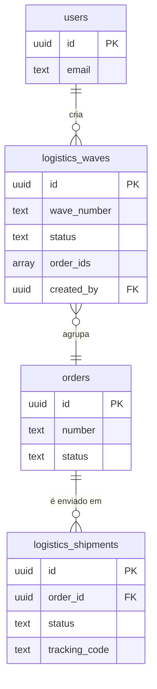

# Documentação Técnica do Módulo: Logística (Logistics) v3.0

**Versão:** 3.0
**Data:** 2024-07-31
**Responsável:** 🧠 ArquitetoSupremo (Crew-Gemini)
**Arquivo Fonte:** `/reports/logistics_v3_diff.md`

---

## 1. Visão Geral

O Módulo de Logística é o centro de operações de expedição do Olie Hub, funcionando como um WMS (Warehouse Management System) simplificado. Sua principal função é orquestrar o processo de saída dos produtos, desde a identificação dos pedidos prontos para envio até a expedição final. Ele organiza o trabalho através de "Ondas de Separação" (Picking Waves), otimiza o fluxo de picking e packing, e fornece um painel de controle visual (Kanban) para o rastreamento dos envios.

-   **Objetivo Operacional:** Aumentar a eficiência da expedição, reduzir erros de separação, e fornecer visibilidade em tempo real sobre o status de cada envio, integrando-se com os módulos de Vendas e Produção.
-   **Papéis Envolvidos:**
    -   `Administrativo`: Criação de ondas de separação, gestão do painel de expedição, acionamento de integrações com transportadoras.
    -   `Producao` (Futuro): Execução das tarefas de picking e packing.
    -   `AdminGeral`: Supervisão do processo, configuração de métodos de entrega.

---

## 2. Estrutura de Dados

A arquitetura de dados da v3.0 é projetada para suportar um fluxo de trabalho de WMS, separando o agrupamento lógico (ondas) do rastreamento físico (envios).

### Tabelas Principais (Schema Ativo no Sandbox)

| Tabela | Descrição |
| :--- | :--- |
| `logistics_waves` | Agrupa múltiplos pedidos em uma única "Onda de Separação" para otimizar o picking. |
| `logistics_shipments`| Representa a expedição de um único pedido, rastreando seu status desde a etiquetagem até a entrega. |

### Campos-Chave

#### `logistics_waves`
| Coluna | Tipo | Descrição |
| :--- | :--- | :--- |
| `id` | `uuid` | Chave primária. |
| `wave_number` | `text` | Identificador legível da onda (ex: WAVE-2024-001). |
| `status` | `text` | Status da onda (FSM). Ex: 'pending', 'picking', 'completed'. |
| `order_ids` | `array` | Array de UUIDs dos pedidos incluídos na onda. |
| `created_by`| `uuid` | ID do usuário que criou a onda. |

#### `logistics_shipments`
| Coluna | Tipo | Descrição |
| :--- | :--- | :--- |
| `id` | `uuid` | Chave primária. |
| `order_id` | `uuid` | Chave estrangeira para `orders.id`. |
| `status` | `text` | Status do envio individual (FSM). Ex: 'label_created', 'in_transit'. |
| `tracking_code`| `text` | Código de rastreio da transportadora. |

### Tabelas Planejadas (Não existentes no Schema atual)
-   `logistics_pick_tasks`: Itens específicos a serem separados em uma onda.
-   `logistics_packages`: Pacotes físicos gerados no packing, com peso e dimensões.
-   `logistics_labels`: Armazenamento de URLs e metadados de etiquetas de envio.

### Diagrama de Relacionamento (ERD)



---

## 3. Regras de Negócio & RLS

### Políticas de Acesso (RLS)
| Papel | Permissões em `logistics_waves` & `logistics_shipments` |
| :--- | :--- |
| `AdminGeral` | CRUD completo. |
| `Administrativo`| `SELECT`, `INSERT`, `UPDATE`. |
| `Producao` | `SELECT`, `UPDATE` (apenas status de picking/packing, futuro). |

### Lógica Central
-   **Fila de Picking (`pickingQueue`):** A regra de negócio mais importante é a geração dinâmica da fila de separação. Ela é composta por todos os pedidos (`orders`) que atendem aos seguintes critérios:
    1.  O status do pedido é `paid` OU `in_production`.
    2.  O ID do pedido **não** existe em nenhuma `order_ids` da tabela `logistics_waves`.
-   Esta lógica é executada no frontend (`useLogistics`) e garante que apenas pedidos prontos e ainda não processados apareçam na fila.

### Máquina de Estados Finitos (FSM)
-   **`WaveStatus`**: `pending` → `picking` → `packing` → `completed` / `cancelled`
-   **`ShipmentStatus`**: `pending` → `quoted` → `label_created` → `in_transit` → `delivered` / `error`

---

## 4. Fluxos Operacionais

O fluxo de logística foi desenhado para guiar o usuário desde o planejamento até a expedição.

```mermaid
graph TD
    subgraph Módulos Anteriores
        A[Pedido Status: 'paid' ou 'in_production']
    end

    subgraph Módulo de Logística
        A --"Lógica do useLogistics"--> B(Aparece na 'Fila de Separação');
        B --> C{Criação de Onda};
        C --"Agrupa Pedidos"--> D[Onda Status: 'pending'];
        
        subgraph Picking & Packing (Futuro)
            D --> E[Inicia Picking];
            E --> F[Valida Itens];
            F --> G[Embala e Pesa];
        end

        G --"Gera Expedição"--> H(Shipment Status: 'pending');

        subgraph Kanban de Expedição
            H --"Cota Frete"--> I[Coluna: 'quoted'];
            I --"Gera Etiqueta"--> J[Coluna: 'label_created'];
            J --"Posta na Transportadora"--> K[Coluna: 'in_transit'];
            K --"Rastreio Confirma"--> L[Coluna: 'delivered'];
        end
    end

    style B fill:#f9f,stroke:#333
    style I fill:#ccf,stroke:#333
```

---

## 5. KPIs & Métricas

| KPI | Descrição | Meta |
| :--- | :--- | :--- |
| **OTIF (On-Time In-Full)** | % de pedidos entregues completos e no prazo. | > 98% |
| **Order-to-Ship Cycle Time** | Tempo médio entre a criação da onda e o status `in_transit` do envio. | < 24 horas |
| **Order Picking Accuracy** | % de pedidos separados sem erros de item ou quantidade. | > 99.5% |
| **Custo de Frete por Pedido** | Custo médio de envio por pedido expedido. | Monitorar Redução |
| **Throughput de Expedição** | Número de pedidos expedidos por dia/semana. | Monitorar Aumento |

---

## 6. Critérios de Aceite

-   [✅] A aba "Fila & Ondas" exibe corretamente os pedidos com status `paid` ou `in_production` que não estão em nenhuma onda.
-   [✅] O diálogo de criação de onda permite selecionar múltiplos pedidos da fila e criar um novo registro em `logistics_waves`.
-   [✅] Após a criação de uma onda, os pedidos correspondentes desaparecem da fila de separação.
-   [✅] A aba "Expedição" exibe um board Kanban com os status corretos.
-   [ ] **Pendente:** As tarefas de picking e packing são geradas quando uma onda é iniciada.
-   [ ] **Pendente:** A finalização do packing gera automaticamente o registro em `logistics_shipments`.
-   [ ] **Pendente:** As ações de integração com transportadoras (cotação, etiqueta) são executáveis a partir do Kanban de expedição.

---

## 7. Auditoria Técnica (Diff) - Consolidação v3.0

A versão 3.0 consolida a visão de WMS, que era mais detalhada na documentação v2, sobre a gestão de status mais genérica da v1.

| Característica | Versão Anterior (Implícita) | Versão Atual (v3.0) | Justificativa da Mudança |
| :--- | :--- | :--- | :--- |
| **Escopo do Módulo** | Gerenciamento de status de entrega e configurações. | Fluxo de trabalho completo de WMS: Fila, Ondas, Picking, Packing, Expedição. | A visão de WMS é mais abrangente e alinhada com as necessidades operacionais de um e-commerce, permitindo maior controle e otimização. |
| **Interface Principal**| Gerenciador de status em tabela. | Abas que representam as etapas do fluxo (`Queue`, `Picking`, `Shipment`). | A UI baseada em fluxo é mais intuitiva para o usuário operacional e reflete o processo físico do armazém. |
| **Lógica de Dados** | Carregamento simples de tabelas de status. | **Lógica Derivada:** O `useLogistics` hook calcula dinamicamente a `pickingQueue` a partir de `orders` e `logistics_waves`, criando uma fonte de dados em tempo real. | Esta abordagem é mais robusta e garante que a fila de trabalho esteja sempre atualizada, sem necessidade de sincronização manual ou triggers complexos. |
| **Diagnóstico de Schema**| `Failed to fetch`. | **Implementado no Sandbox:** As tabelas `logistics_waves` e `logistics_shipments` foram criadas no `sandboxDb.ts`. O módulo é resiliente e exibe placeholders para funcionalidades futuras. | O desenvolvimento pôde avançar com a arquitetura correta, e o sistema está pronto para "ativar" as funcionalidades de picking/packing assim que as tabelas forem migradas. |

---

## 8. Ações Recomendadas / Pendentes

1.  **[ALTA] Migrar Schema Base:** Criar as tabelas `public.logistics_waves` e `public.logistics_shipments` no Supabase de produção.
2.  **[MÉDIA] Implementar Picking & Packing:**
    -   Criar as tabelas `public.logistics_pick_tasks` e `public.logistics_packages`.
    -   Desenvolver a UI para a aba "Picking & Packing", substituindo o placeholder atual. A interface deve permitir que o operador veja os itens de uma onda e confirme a separação.
3.  **[MÉDIA] Integrar com Transportadoras:** No Kanban de Expedição, implementar a lógica nos cards para chamar o `integrationsService` e simular/executar a cotação de frete e a geração de etiquetas.
4.  **[BAIXA] Desenvolver Configurações:** Implementar a UI da aba "Configurações" para permitir o CRUD de métodos de entrega, parâmetros de frete e tipos de embalagem, criando as tabelas correspondentes.