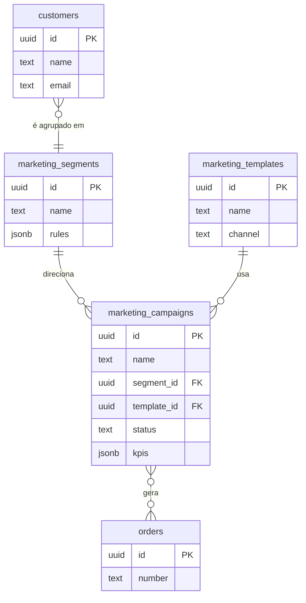
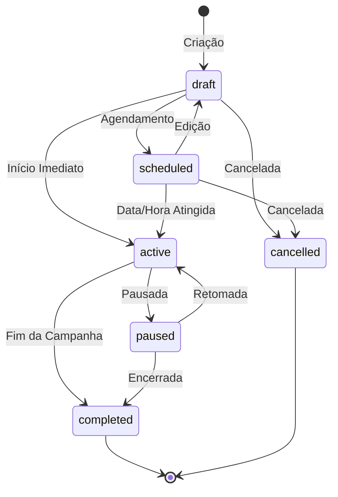

# Documentação Técnica do Módulo: Marketing v3.0

**Versão:** 3.0 (Implantação Base)
**Data:** 2024-07-31
**Responsável:** 🧠 ArquitetoSupremo (Crew-Gemini)
**Arquivo Fonte:** `/reports/marketing_v3_diff.md`

---

## 1. Visão Geral

O Módulo de Marketing é a plataforma de automação e engajamento do cliente do Olie Hub. Ele capacita a equipe de conteúdo e vendas a criar, gerenciar e analisar campanhas de comunicação em múltiplos canais (Email, SMS, WhatsApp, Instagram). O módulo é estruturado em torno de três pilares: **Segmentação** (definir o público), **Templates** (criar a mensagem) e **Campanhas** (executar e medir).

-   **Objetivo Operacional:** Aumentar o engajamento do cliente, impulsionar vendas através de comunicações direcionadas, automatizar o marketing e fornecer métricas claras sobre o Retorno sobre o Investimento (ROI) de cada iniciativa.
-   **Papéis Envolvidos:**
    -   `Conteudo`: Criação e gerenciamento de campanhas, templates e segmentos.
    -   `AdminGeral`: Acesso total para supervisão, análise de performance e configuração de integrações.
    -   `Vendas`: Consulta de campanhas para alinhamento com as estratégias de abordagem.

---

## 2. Estrutura de Dados

A arquitetura de dados da v3.0 é modular e projetada para um sistema de marketing robusto. **Nenhuma das tabelas a seguir existe no schema de produção; elas foram implementadas no sandbox para guiar o desenvolvimento da UI.**

### Tabelas Principais (Implementadas no Sandbox)

| Tabela | Descrição |
| :--- | :--- |
| `marketing_campaigns` | Tabela central que armazena os dados de cada campanha de marketing. |
| `marketing_segments`| Define os públicos-alvo com base em regras aplicadas à base de clientes. |
| `marketing_templates`| Armazena os modelos de mensagem reutilizáveis para os diferentes canais. |

### Campos-Chave

#### `marketing_campaigns`
| Coluna | Tipo | Descrição |
| :--- | :--- | :--- |
| `id` | `uuid` | Chave primária. |
| `name` | `text` | Nome da campanha. |
| `status` | `text` | Status da campanha (FSM): 'draft', 'scheduled', 'active', 'completed'. |
| `channels` | `array`| Canais a serem utilizados (ex: {'email', 'whatsapp'}). |
| `segment_id`| `uuid` | FK para `marketing_segments.id`. |
| `template_id`| `uuid` | FK para `marketing_templates.id`. |
| `budget` | `numeric`| Orçamento alocado para a campanha. |
| `spent` | `numeric` | Valor gasto até o momento. |
| `kpis` | `jsonb` | Objeto JSON para armazenar métricas (enviados, aberturas, cliques, conversões). |

#### `marketing_segments` e `marketing_templates`
| Tabela | Coluna | Descrição |
| :--- | :--- | :--- |
| `segments` | `name` | Nome do segmento (ex: "Clientes VIP"). |
| `segments` | `rules_json` | (Proposto) JSON com as regras de filtragem. |
| `templates`| `name` | Nome do template (ex: "Boas-vindas Inverno 2024"). |
| `templates`| `channel`| Canal ao qual o template se aplica. |
| `templates`| `content` | Conteúdo da mensagem (HTML, texto). |

### Diagrama de Relacionamento (ERD) Proposto



---

## 3. Regras de Negócio & RLS (Propostos)

### Políticas de Acesso (RLS)
| Papel | Permissões em `marketing_*` |
| :--- | :--- |
| `AdminGeral` | CRUD completo. |
| `Conteudo` | `SELECT`, `INSERT`, `UPDATE`. |
| Outros | Acesso de leitura (`SELECT`). |

### Máquina de Estados Finitos (FSM) - `marketing_campaigns.status`


### Lógica Central
- **Execução e Tracking:** A execução real de uma campanha (envio de emails/mensagens) e o rastreamento de eventos (aberturas, cliques) devem ser gerenciados por processos de backend (Supabase Edge Functions), acionados por um agendador (`cron job`) para campanhas agendadas ou por um gatilho para campanhas de início imediato.

---

## 4. Fluxos Operacionais

O fluxo de marketing é proativo, iniciando com a estratégia e terminando com a análise de resultados.

```mermaid
graph TD
    subgraph Módulo de Marketing (UI)
        A[Cria Segmento de Clientes] --> B[Cria Template de Mensagem];
        B --> C{Cria Campanha};
        C --"Associa Segmento e Template"--> D[Campanha Status: 'draft'];
        D --"Agenda/Inicia"--> E[Campanha Status: 'scheduled' ou 'active'];
    end

    subgraph Backend (Edge Functions)
        E --"Scheduler/Trigger"--> F{Processa Fila de Envio};
        F --"Chama APIs Externas"--> G[Envia Mensagens];
    end
    
    subgraph Tracking
        H[Cliente Abre/Clica] --"Webhook/Pixel"--> I{Registra Evento};
    end

    subgraph Módulo de Analytics (DB)
        I --"Atualiza JSON de KPIs"--> J[Atualiza `marketing_campaigns.kpis`];
    end
```

---

## 5. KPIs & Métricas

| KPI | Descrição |
| :--- | :--- |
| **Open Rate** | % de destinatários que abriram a mensagem. |
| **Click-Through Rate (CTR)** | % de destinatários que clicaram em um link na mensagem. |
| **Conversion Rate** | % de destinatários que completaram uma ação desejada (ex: compra). |
| **Return On Investment (ROI)** | (Receita Gerada - Custo) / Custo. |
| **Custo por Aquisição (CPA)** | Custo total da campanha / Número de conversões. |
| **Taxa de Unsubscribe** | % de usuários que se descadastraram da lista. |

---

## 6. Critérios de Aceite

-   [✅] A UI do módulo exibe abas para Campanhas, Segmentos, Templates e Dashboard.
-   [✅] O `CampaignDialog` permite a criação e edição de campanhas, incluindo a geração de descrição com IA.
-   [✅] A lista de campanhas (`CampaignList`) exibe os `CampaignCard`s com os dados do sandbox.
-   [✅] Os componentes `SegmentManager` e `TemplateEditor` exibem placeholders informativos, pois suas funcionalidades completas estão em desenvolvimento.
-   [ ] **Pendente:** As tabelas `marketing_campaigns`, `marketing_segments` e `marketing_templates` existem no ambiente de produção.
-   [ ] **Pendente:** A lógica de envio de mensagens está implementada no backend.
-   [ ] **Pendente:** O mecanismo de rastreamento de eventos e atualização de KPIs está funcional.
-   [ ] **Pendente:** A UI para criação de regras de segmento e edição de templates está implementada.

---

## 7. Auditoria Técnica (Diff) - Implantação v3.0

Esta é a primeira implementação formal do Módulo de Marketing, estabelecendo a arquitetura base para o gerenciamento de comunicações.

-   **Abordagem "UI-First":** A v3.0 foi desenvolvida com foco na experiência do usuário. Toda a interface de gerenciamento de campanhas foi construída e validada utilizando dados do `sandboxDb.ts`. Isso permitiu a criação de componentes robustos como `CampaignCard` e `CampaignDialog` antes mesmo da existência das tabelas no banco de dados de produção.
-   **Hook Centralizador (`useMarketing`):** Toda a complexidade de estado, filtros e interações com o `dataService` é encapsulada neste hook. Ele foi projetado para ser resiliente, emitindo logs claros sobre quais tabelas (`marketing_campaigns`, `marketing_segments`, etc.) foram carregadas com sucesso e quais estão ausentes.
-   **Integração com IA:** A funcionalidade de gerar descrição de campanha com Gemini (`geminiService`) foi integrada diretamente no fluxo de criação, demonstrando o potencial de IA para agilizar tarefas criativas e repetitivas.
-   **Placeholders Estratégicos:** As abas de Segmentos, Templates e Dashboard foram implementadas com componentes de placeholder (`EmptyState`, `SegmentManager`, etc.), o que permite ao usuário entender o escopo completo do módulo e sinaliza claramente quais funcionalidades estão em desenvolvimento.

---

## 8. Ações Recomendadas / Pendentes

1.  **[ALTA] Criar Schema no Supabase:** Criar as tabelas `public.marketing_campaigns`, `public.marketing_segments` e `public.marketing_templates` no ambiente de produção.
2.  **[MÉDIA] Implementar UI de Segmentos e Templates:** Desenvolver a lógica e a interface do usuário para o construtor de regras de segmentação (`SegmentManager`) e para o editor de conteúdo de mensagens (`TemplateEditor`).
3.  **[MÉDIA] Desenvolver Backend de Envio:** Criar as Supabase Edge Functions responsáveis por processar as campanhas ativas, buscar os destinatários nos segmentos e enviar as mensagens através de APIs de terceiros (ex: SendGrid para email, Twilio para SMS).
4.  **[BAIXA] Implementar Tracking e Dashboard:** Desenvolver o endpoint de webhook para receber eventos de tracking e a lógica para agregar esses dados e exibi-los nos gráficos do `DashboardPanel`.