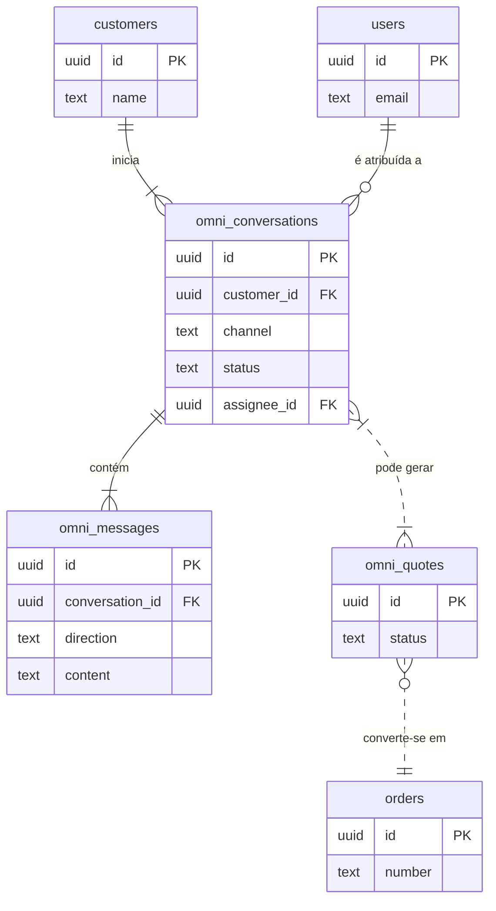

# Documentação Técnica do Módulo: Omnichannel (Atendimento) v2.0

**Versão:** 2.0 (Arquitetura Base)
**Data:** 2024-07-31
**Responsável:** 🧠 ArquitetoSupremo (Crew-Gemini)
**Arquivo Fonte:** `/reports/omnichannel_v2_diff.md`

---

## 1. Visão Geral

O Módulo Omnichannel é a central de comunicação do Olie Hub, projetado para unificar todas as interações com clientes em uma única interface. Ele agrega conversas de múltiplos canais (WhatsApp, Instagram, Site), permitindo que a equipe de atendimento e vendas gerencie tickets, responda a clientes, crie orçamentos e converta conversas em pedidos de forma eficiente e rastreável.

-   **Objetivo Operacional:** Centralizar o atendimento ao cliente, reduzir o tempo de resposta, melhorar a experiência do cliente e aumentar a taxa de conversão de leads provenientes de canais de comunicação direta.
-   **Papéis Envolvidos:**
    -   `Vendas` / `Conteudo`: Atendimento direto ao cliente, gerenciamento de conversas, criação de orçamentos.
    -   `Administrativo`: Supervisão do fluxo de atendimento, atribuição de conversas.
    -   `AdminGeral`: Acesso total para análise de métricas e configuração de canais.

---

## 2. Estrutura de Dados

A arquitetura de dados proposta para a v2.0 é desenhada para ser flexível e escalável, suportando múltiplos canais e tipos de mensagem. **Nenhuma das tabelas a seguir existe no schema atual do sandbox; elas representam a arquitetura planejada com base nos tipos (`types.ts`) e componentes (`OmnichannelPage.tsx`) já existentes.**

### Tabelas Planejadas

| Tabela | Descrição |
| :--- | :--- |
| `omni_conversations` | Armazena o estado de uma conversa com um cliente, independente do canal. |
| `omni_messages` | Registra cada mensagem individual (entrada, saída ou nota interna) dentro de uma conversa. |
| `omni_quotes` | Gerencia orçamentos criados durante uma conversa antes de se tornarem um pedido formal. |
| `omni_channels` | Configuração dos canais de comunicação conectados (ex: WhatsApp API, Instagram Graph API). |

### Campos-Chave Propostos

#### `omni_conversations`
| Coluna | Tipo | Descrição |
| :--- | :--- | :--- |
| `id` | `uuid` | Chave primária. |
| `customer_id` | `uuid` | FK para `customers.id`. |
| `channel` | `text` | Canal de origem (ex: 'whatsapp'). |
| `status` | `text` | Status da conversa ('open', 'closed', 'pending'). |
| `assignee_id` | `uuid` | FK para `users.id` (agente responsável). |
| `priority` | `text` | Prioridade do atendimento. |
| `tags` | `array` | Tags para categorização (ex: 'novo_lead', 'suporte'). |
| `last_message_at`| `timestamptz` | Data da última mensagem para ordenação. |

#### `omni_messages`
| Coluna | Tipo | Descrição |
| :--- | :--- | :--- |
| `id` | `uuid` | Chave primária. |
| `conversation_id`| `uuid` | FK para `omni_conversations.id`. |
| `direction` | `text` | Direção da mensagem ('in', 'out', 'note'). |
| `content` | `text` | Conteúdo da mensagem. |
| `author_name` | `text` | Nome do remetente (cliente ou agente). |
| `status` | `text` | Status de entrega da mensagem ('sent', 'delivered', 'read'). |

### Diagrama de Relacionamento (ERD) Proposto



---

## 3. Regras de Negócio & RLS (Propostos)

### Políticas de Acesso (RLS)
| Papel | Permissões em `omni_conversations` |
| :--- | :--- |
| `AdminGeral` | CRUD completo. |
| `Administrativo`| `SELECT` em todas, `UPDATE` para atribuição (`assignee_id`). |
| `Vendas` / `Conteudo` | `SELECT` e `UPDATE` apenas em conversas atribuídas a si (`assignee_id = auth.uid()`) ou não atribuídas (`assignee_id IS NULL`). `INSERT` em `omni_messages`. |

### Lógica Central
-   **Criação de Conversa:** A primeira mensagem recebida de um `customer_id` em um `channel` que não tenha uma conversa `open` ou `pending` deve criar um novo registro em `omni_conversations`.
-   **Atribuição:** Uma conversa pode ser atribuída a um agente específico. Apenas o agente atribuído (ou um admin) pode responder.
-   **SLA:** O sistema deve calcular o tempo da primeira resposta e o tempo médio de atendimento para fins de KPI.

---

## 4. Fluxos Operacionais

O fluxo do Omnichannel é reativo, iniciando com a ação de um cliente.

```mermaid
graph TD
    subgraph Canais Externos
        A[Cliente envia mensagem via WhatsApp/Instagram]
    end

    subgraph Backend (Webhook)
        A --> B{API Gateway};
        B --"Recebe Mensagem"--> C[Verifica/Cria Conversa no DB];
    end

    subgraph Olie Hub UI
        C --> D(Conversa aparece na Caixa de Entrada);
        D --"Agente clica"--> E{Atribui a si mesmo};
        E --> F[Troca de Mensagens com Cliente];
        F --"Negociação"--> G{Cria Orçamento};
        G --"Cliente aprova"--> H(Converte em Pedido);
        H --> I[Fecha Conversa];
    end

    subgraph Módulo de Pedidos
        H --"Cria Registro"--> J[Novo Pedido];
    end

    style B fill:#f9f,stroke:#333
    style J fill:#ccf,stroke:#333
```

---

## 5. KPIs & Métricas

| KPI | Descrição | Meta |
| :--- | :--- | :--- |
| **First Response Time (FRT)** | Tempo médio para a primeira resposta a uma nova conversa. | < 15 minutos |
| **Average Handle Time (AHT)** | Tempo médio total de uma conversa, do início ao fim. | < 2 horas |
| **Customer Satisfaction (CSAT)** | Nota de satisfação do cliente ao final do atendimento. | > 4.5 / 5 |
| **Conversion Rate** | % de conversas que resultam em um pedido. | > 20% |
| **Tickets Resolvidos por Agente** | Número de conversas fechadas por agente por dia. | Monitorar |

---

## 6. Critérios de Aceite

-   [ ] **Pendente:** As tabelas `omni_conversations`, `omni_messages`, e `omni_quotes` existem no banco de dados.
-   [ ] **Pendente:** Um webhook está configurado para receber mensagens do WhatsApp/Instagram e inseri-las no banco.
-   [✅] A UI do `OmnichannelPage` exibe a lista de conversas, a thread de mensagens e o painel do cliente.
-   [ ] **Pendente:** O envio de mensagens pela UI funciona e cria registros em `omni_messages`.
-   [ ] **Pendente:** O sistema de atribuição de conversas (`assignee_id`) está funcional.
-   [ ] **Pendente:** A funcionalidade de criar orçamentos e convertê-los em pedidos está implementada.

---

## 7. Auditoria Técnica (Diff) - Implantação v2.0

Esta documentação representa a **primeira versão formal (v2.0)** da arquitetura do Módulo Omnichannel.

-   **Análise do Sandbox:** A auditoria confirmou a **ausência total** de tabelas com o prefixo `omni_*` no schema do sandbox (`exports/schema.json`). No entanto, a estrutura de dados (`types.ts`) e a interface do usuário (`OmnichannelPage.tsx` e seus subcomponentes) já estão pré-construídas, definindo um contrato claro entre o frontend e o backend a ser desenvolvido.
-   **Arquitetura Frontend:** A UI já implementa um layout de três colunas (Lista de Conversas, Thread de Mensagens, Painel do Cliente) com componentes `Resizable`, indicando uma experiência de usuário madura e bem planejada.
-   **Estado Atual:** O módulo está em estado de "UI-ready". O frontend está pronto para ser conectado a um backend funcional. Os dados no sandbox (`sandboxDb.ts`) estão vazios, o que faz com que a UI exiba seus estados de "carregamento" e "vazio" corretamente.

---

## 8. Ações Recomendadas / Pendentes

1.  **[CRÍTICO] Criar Schema do Banco de Dados:** A prioridade máxima é criar as tabelas propostas (`omni_conversations`, `omni_messages`, `omni_quotes`) no Supabase de produção.
2.  **[ALTA] Implementar Webhook de Ingestão:** Desenvolver uma Edge Function no Supabase para atuar como webhook. Esta função receberá payloads das APIs do WhatsApp e Instagram, processará as mensagens e as inserirá nas tabelas corretas.
3.  **[MÉDIA] Implementar Lógica de Envio:** Conectar o `Composer` da UI a uma função que envia mensagens de saída através das APIs dos respectivos canais.
4.  **[MÉDIA] Desenvolver Lógica de Orçamentos:** Implementar a funcionalidade de criação de `omni_quotes` e sua conversão para `orders`, integrando com o Módulo de Pedidos.
5.  **[BAIXA] Implementar Métricas:** Após a base funcional estar pronta, desenvolver os dashboards para acompanhar os KPIs de atendimento.
