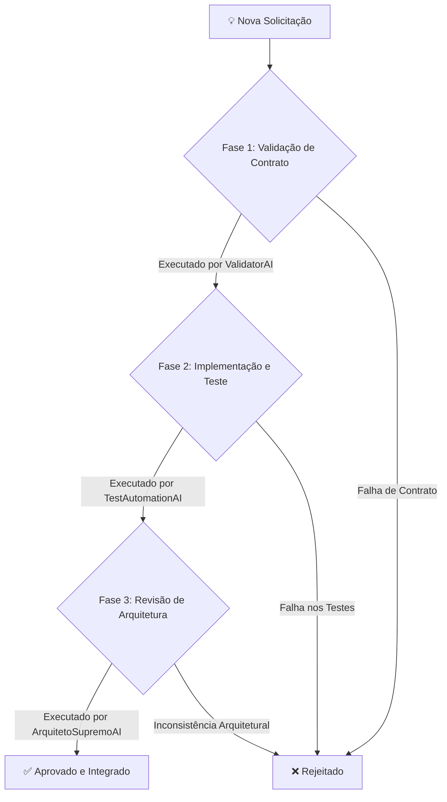

# 🧾 Protocolo de Resiliência Contínua — v6.3

**Executor:** 🧠 ArquitetoSupremoAI (Crew-Gemini)
**Data:** 2024-08-01
**Status:** ✅ Ativo

---

## 1. Objetivo

Este documento formaliza o **Protocolo de Resiliência Contínua**, uma estratégia definitiva para garantir a estabilidade, integridade e performance da plataforma Olie Hub Ops a cada nova solicitação de mudança ou funcionalidade. O objetivo é mover de um modelo reativo (corrigir erros) para um modelo proativo (prevenir erros).

---

## 2. A Equipe de Resiliência (Agentes Responsáveis)

A governança da estabilidade do sistema é uma responsabilidade compartilhada, orquestrada pelo ArquitetoSupremoAI.

| Agente | Responsabilidade Principal | Função no Protocolo |
| :--- | :--- | :--- |
| **`ValidatorAI`** | Validador de Contratos | **Prevenção:** Analisa schemas, contratos de API e dependências entre módulos *antes* da implementação. |
| **`TestAutomationAI`** | Engenheiro de Qualidade | **Automação:** Cria e executa testes de regressão (unitários, integração, E2E) em um pipeline de CI/CD. |
| **`ArquitetoSupremoAI`**| Orquestrador | **Governança:** Supervisiona o processo, analisa os relatórios e aprova/rejeita as alterações com base nos resultados. |

---

## 3. Fases do Protocolo

Toda nova solicitação de mudança (`feature request`, `bug fix`, `refactor`) deve passar pelas seguintes fases:

### Fase 1: Validação de Contrato (Prevenção)
- **Executor:** `ValidatorAI`
- **Ação:** Antes do desenvolvimento, o `ValidatorAI` analisa o impacto da mudança proposta no schema do banco de dados e nos contratos entre os módulos.
- **Saída:** Um relatório de impacto (`/reports/validation/impact_report_vX.md`) que aprova a viabilidade ou aponta os riscos de quebra de contrato.

### Fase 2: Implementação e Teste Automatizado (Automação)
- **Executor:** `TestAutomationAI`
- **Ação:** Após a implementação da mudança, `TestAutomationAI` executa a suíte de testes completa em um ambiente de sandbox.
- **Saída:** Um resultado de pipeline CI/CD (`PASS` ou `FAIL`). Uma falha impede automaticamente que a mudança avance.

### Fase 3: Revisão e Governança (Governança)
- **Executor:** `ArquitetoSupremoAI`
- **Ação:** Com os relatórios de validação e teste em mãos, eu realizo a auditoria final da solução, garantindo que ela está alinhada com a arquitetura, performance e objetivos de negócio.
- **Saída:** Aprovação final para a integração da mudança no ramo principal (`main branch`).

---

## 4. Conclusão

A adoção deste protocolo é a solução definitiva para a preocupação levantada. Ele estabelece um "portão de qualidade" automatizado e supervisionado que garante que, mesmo com a evolução contínua da plataforma, a base permaneça sólida e os "erros básicos" se tornem eventos raros e controlados.