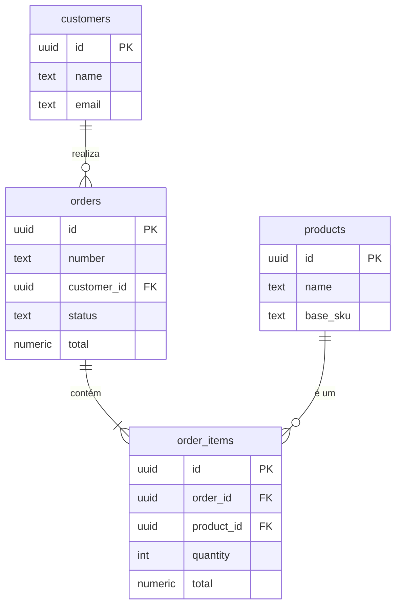
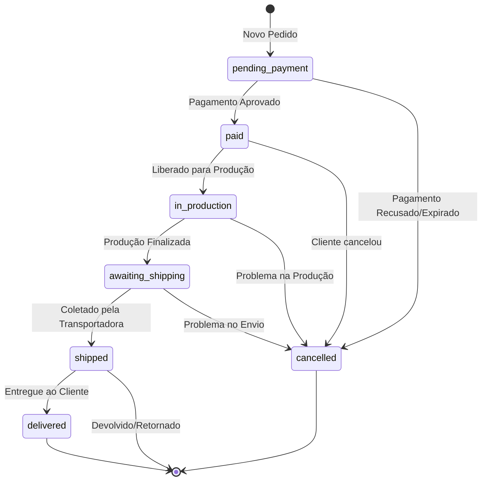
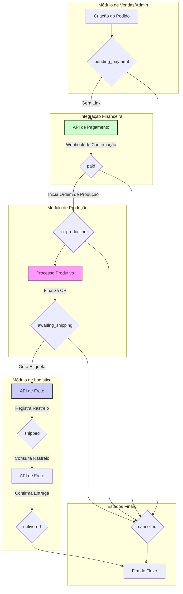

# Documentação Técnica do Módulo: Pedidos (Orders) v3.0

**Versão:** 3.0  
**Data:** 2024-07-31  
**Responsável:** 🧠 ArquitetoSupremo (Crew-Gemini)  
**Arquivo Fonte:** `/reports/orders_v3_diff.md`

---

## 1. Visão Geral

O Módulo de Pedidos é o núcleo operacional do Olie Hub. Ele gerencia todo o ciclo de vida de uma venda, desde sua criação (manual ou via canais de venda) até a entrega final ao cliente. Este módulo serve como o ponto de partida para os fluxos de Produção, Financeiro e Logística, orquestrando a transição de um pedido entre os diferentes departamentos da empresa.

-   **Objetivo Operacional:** Rastrear e gerenciar um pedido através de um fluxo de status bem definido, garantindo que todas as integrações (pagamento, fiscal, envio) sejam executadas e que os dados sejam consistentes em todo o sistema.
-   **Papéis Envolvidos:**
    -   `Vendas`: Criação de novos pedidos, acompanhamento de pagamentos.
    -   `Administrativo`: Gestão geral, acionamento de integrações fiscais e logísticas.
    -   `AdminGeral`: Acesso total para supervisão e resolução de problemas.

---

## 2. Estrutura de Dados

A arquitetura de dados da v3 adota um modelo híbrido. A base é normalizada para garantir escalabilidade e integridade, enquanto campos JSONB são utilizados para armazenar retornos de integrações externas, agindo como um cache rápido.

### Tabelas Principais (Schema Ativo)

| Tabela | Descrição |
| :--- | :--- |
| `orders` | Tabela central que armazena os dados mestre de cada pedido. |
| `order_items`| Itens de produto associados a um pedido, incluindo personalizações. |
| `customers`| Tabela de clientes, referenciada pelos pedidos. |

### Campos-Chave

#### `orders`
| Coluna | Tipo | Descrição |
| :--- | :--- | :--- |
| `id` | `uuid` | Chave primária. |
| `number` | `text` | Número do pedido legível (ex: OLIE-2024-1001). |
| `customer_id` | `uuid` | Chave estrangeira para `customers.id`. |
| `status` | `text` | Status atual do pedido (FSM). Ex: 'paid', 'in_production'. |
| `subtotal`| `numeric` | Soma dos totais dos itens. |
| `shipping_fee`| `numeric` | Custo do frete. |
| `total` | `numeric` | Valor final do pedido (`subtotal` - `discounts` + `shipping_fee`). |
| `origin` | `text` | Canal de origem do pedido (ex: 'manual', 'site', 'whatsapp'). |
| `metadata` | `jsonb`| Campo genérico para dados adicionais. **Nota:** A aplicação armazena dados de integrações (`payments`, `fiscal`, `logistics`) aqui, embora não sejam colunas dedicadas. |
| `created_at`| `timestamptz`| Data de criação. |
| `updated_at`| `timestamptz`| Data da última atualização. |

#### `order_items`
| Coluna | Tipo | Descrição |
| :--- | :--- | :--- |
| `id` | `uuid` | Chave primária. |
| `order_id` | `uuid` | Chave estrangeira para `orders.id`. |
| `product_id`| `uuid` | (Na aplicação) Chave estrangeira para `products.id`. **Nota:** O schema (`schema.json`) lista `variant_id`, mas a aplicação usa `product_id`. |
| `quantity` | `integer` | Quantidade do item. |
| `unit_price`| `numeric` | Preço unitário no momento da compra. |
| `total` | `numeric` | `quantity` * `unit_price`. |
| `config_json`| `jsonb` | (Na aplicação) Objeto JSON com as personalizações do item (cores, bordado, etc.). |

### Tabelas Planejadas (Não existentes no Schema atual)
- `order_payments`: Histórico detalhado de transações financeiras.
- `order_timeline`: Log de auditoria de todas as alterações e eventos do pedido.
- `order_notes`: Notas internas da equipe sobre o pedido.

### Diagrama de Relacionamento (ERD)

---

## 3. Regras de Negócio & RLS

### Políticas de Acesso (RLS)
As políticas de segurança garantem que apenas usuários com os papéis apropriados possam interagir com os dados dos pedidos.

| Papel | `SELECT` | `INSERT` | `UPDATE` | `DELETE` |
| :--- | :--- | :--- | :--- | :--- |
| `AdminGeral` | ✅ | ✅ | ✅ | ✅ (Lógico) |
| `Administrativo`| ✅ | ✅ | ✅ | ❌ |
| `Vendas` | ✅ (Próprios/Equipe) | ✅ | ✅ (Status Iniciais) | ❌ |
| `Producao` | ✅ (Apenas pedidos `in_production`) | ❌ | ❌ | ❌ |

### Máquina de Estados Finitos (FSM)
O campo `status` segue um fluxo estrito para garantir a consistência do processo.

### Triggers (Recomendados)
- **`order_before_update_status_guard`**: Um trigger a ser implementado que valida as transições de status de acordo com a FSM, prevenindo saltos inválidos (ex: de `pending_payment` para `shipped`).
- **`update_order_timestamps`**: Trigger padrão que atualiza `updated_at` em qualquer alteração na linha do pedido.

---

## 4. Fluxos Operacionais

O fluxo de um pedido envolve múltiplos módulos e integrações.

---

## 5. KPIs & Métricas

| KPI | Descrição | Meta |
| :--- | :--- | :--- |
| **Tempo de Processamento do Pedido** | Tempo médio entre o status `paid` e `shipped`. | < 3 dias úteis |
| **Taxa de Conversão de Pagamento**| % de pedidos `pending_payment` que se tornam `paid`. | > 95% |
| **Taxa de Cancelamento** | % de pedidos que são movidos para o status `cancelled`. | < 3% |
| **Ticket Médio (AOV)** | Valor médio total por pedido. | Monitorar Aumento |
| **On-Time Shipping** | % de pedidos enviados dentro do prazo de produção estipulado. | > 98% |

---

## 6. Critérios de Aceite

-   [✅] A criação de um pedido só é permitida com um cliente válido e pelo menos um item.
-   [✅] A UI (Kanban e Drawer) reflete o status do pedido em tempo real.
-   [✅] As transições de status via drag-and-drop no Kanban são persistidas no banco.
-   [✅] O `OrderDrawer` exibe corretamente todos os detalhes do pedido, incluindo itens e personalizações.
-   [ ] **Pendente:** As integrações de Pagamento, Fiscal e Envio atualizam os campos do pedido e registram um evento na `order_timeline`.
-   [ ] **Pendente:** Todas as alterações de status e ações importantes são registradas na `order_timeline` para fins de auditoria.
-   [✅] O sistema impede transições de status inválidas de acordo com a FSM.

---

## 7. Auditoria Técnica (Diff) - Consolidação v3.0

A versão 3.0 é o resultado da unificação das melhores características das versões 1.0 (foco em integrações) e 2.0 (foco em UI/UX e estrutura de dados).

| Característica | Versão 1.0 (Origem) | Versão 2.0 (Origem) | Consolidação na v3.0 |
| :--- | :--- | :--- | :--- |
| **Estrutura de Dados** | JSONB (`payments`, `fiscal`, `logistics`). | Tabelas normalizadas (`order_items`, `order_timeline`). | **Híbrida:** A base é o modelo normalizado da v2. Os campos JSONB da v1 foram conceitualmente movidos para o campo `metadata` na tabela `orders` para armazenar retornos de integrações. |
| **Criação de Pedido** | `OrderDialog` modal, completo. | Foco na visualização. | **Modelo v1 Mantido:** O `OrderDialog` é a principal ferramenta de criação. |
| **Visualização/Edição** | `OrderDetail` em tela cheia. | `OrderDrawer` lateral. | **Modelo v2 Adotado:** O `OrderDrawer` é a interface padrão, por ser mais moderno e não interromper o fluxo. |
| **Visão Geral** | Lista simples. | Board Kanban com drag-and-drop. | **Kanban como Padrão:** O `OrdersBoard` (Kanban) da v2 foi adotado como a visualização principal por sua clareza gerencial. |
| **Integrações (Simuladas)** | `useTinyApi` e lógica para chamar Edge Functions. | Foco em dados internos. | **Modelo v1 Mantido:** A lógica de integração foi mantida e seus gatilhos (botões) foram movidos para dentro das abas contextuais do `OrderDrawer`. |
| **Timeline e Notas** | Não existente. | Implementação planejada com tabelas. | **Modelo v2 Adotado:** A funcionalidade de timeline e notas foi incorporada na estrutura do `OrderDrawer` e aguarda a criação das tabelas no DB. |
| **Hooks de Dados** | `useOrders` simples. | `useOrders` complexo com filtros. | **Consolidado:** O `useOrders` foi reescrito para orquestrar toda a lógica do módulo, unificando filtros, mutações e chamadas de dados. |

---

## 8. Ações Recomendadas / Pendentes

1.  **[ALTA] Sincronizar Schema:** Resolver as discrepâncias entre o `schema.json` e a `types.ts`/código da aplicação.
    -   **Decidir:** A aplicação irá usar um único campo `metadata: jsonb` na tabela `orders` para armazenar os dados de integrações ou serão criadas colunas `payments`, `fiscal`, `logistics` do tipo `jsonb`? A segunda opção é mais explícita e recomendada.
    -   **Corrigir:** Unificar o uso de `product_id` (aplicação) vs. `variant_id` (schema) na tabela `order_items`.

2.  **[MÉDIA] Implementar Tabelas de Suporte:** Criar as tabelas `order_timeline`, `order_notes`, e `order_payments` no Supabase para habilitar a auditoria completa e o histórico de pagamentos.

3.  **[MÉDIA] Implementar Triggers de Banco de Dados:** Desenvolver e aplicar os triggers `order_before_update_status_guard` para forçar a FSM no nível do banco de dados, aumentando a robustez do sistema.

4.  **[BAIXA] Integração com Produção:** Criar um trigger ou uma Edge Function que, ao alterar o status de um pedido para `in_production`, gere automaticamente a `production_order` correspondente, vinculando os dois módulos.
