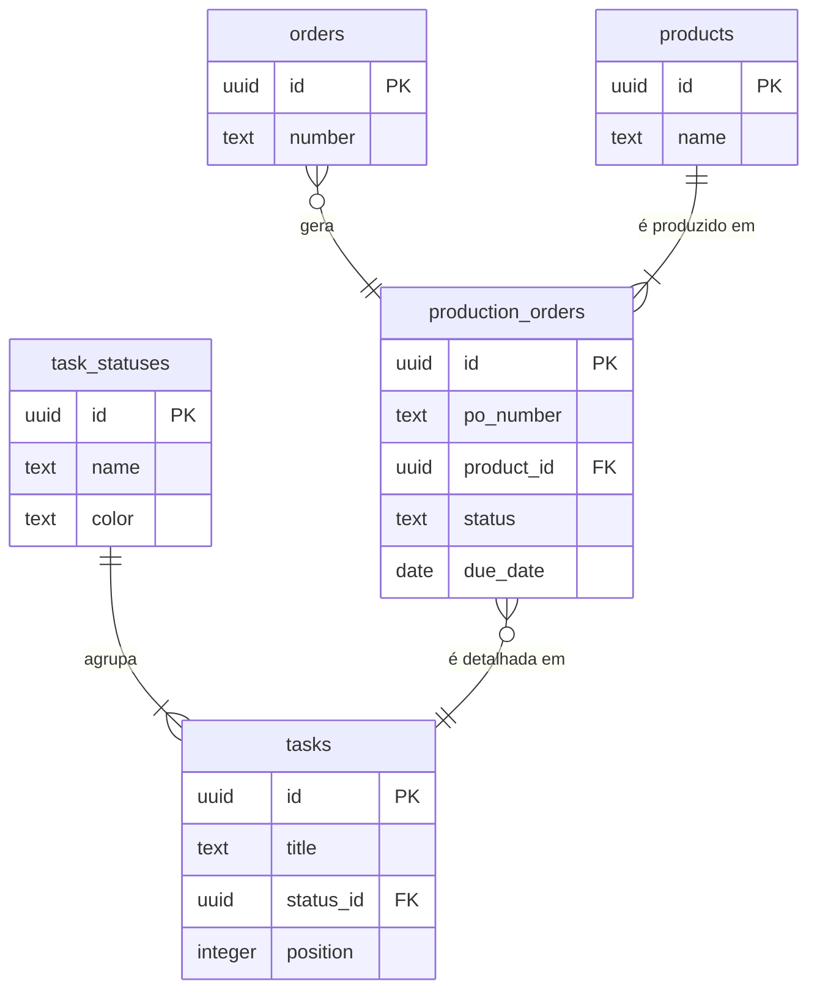
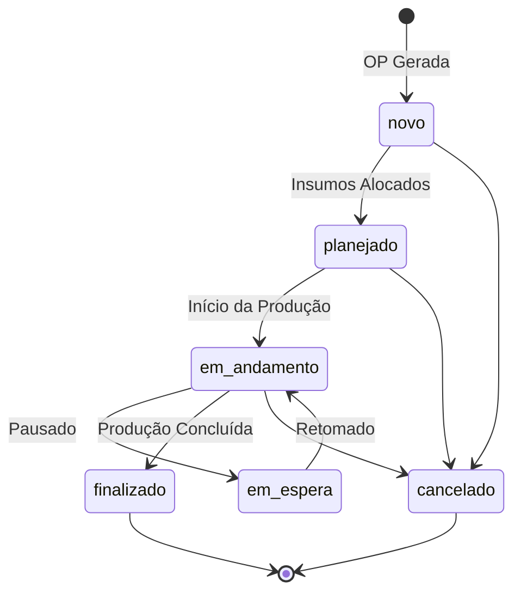
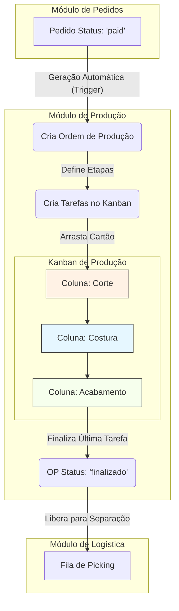

# Documentação Técnica do Módulo: Produção (Production) v3.0

**Versão:** 3.0  
**Data:** 2024-07-31  
**Responsável:** 🧠 ArquitetoSupremo (Crew-Gemini)  
**Arquivo Fonte:** `/reports/production_v3_diff.md`

---

## 1. Visão Geral

O Módulo de Produção é o centro de manufatura do Olie Hub. Sua função é traduzir os pedidos de venda aprovados em Ordens de Produção (OPs) executáveis, gerenciando todo o fluxo de trabalho no ateliê, desde o planejamento e separação de materiais até a finalização do produto. Ele fornece visibilidade do chão de fábrica através de uma interface Kanban e gerencia o ciclo de vida macro de cada OP.

-   **Objetivo Operacional:** Orquestrar e rastrear a produção de itens, garantir o cumprimento de prazos (`due_date`), e fornecer dados de status em tempo real para os módulos de Logística e Vendas.
-   **Papéis Envolvidos:**
    -   `Producao`: Responsável por mover tarefas no Kanban, atualizar status das OPs e registrar informações do processo.
    -   `AdminGeral`: Acesso total para planejamento, priorização, e resolução de problemas.

---

## 2. Estrutura de Dados

A arquitetura de dados da v3.0 adota um modelo dual para máxima flexibilidade gerencial:
1.  **Ordens de Produção (`production_orders`):** Entidade macro que representa o pedido de produção como um todo.
2.  **Tarefas (`tasks`):** Entidades micro que representam as etapas do processo produtivo no Kanban (ex: Corte, Costura).

### Tabelas Principais (Schema Ativo no Sandbox)

| Tabela | Descrição |
| :--- | :--- |
| `production_orders` | Armazena os dados mestre de cada Ordem de Produção. |
| `tasks` | Representa os cartões no Kanban, detalhando as etapas de uma OP. |
| `task_statuses` | Define as colunas (status) do board Kanban de produção. |

### Campos-Chave

#### `production_orders`
| Coluna | Tipo | Descrição |
| :--- | :--- | :--- |
| `id` | `uuid` | Chave primária. |
| `po_number` | `text` | Número da Ordem de Produção (ex: OP-2024-001). |
| `product_id` | `uuid` | Chave estrangeira para `products.id`. |
| `quantity` | `integer`| Quantidade a ser produzida. |
| `status` | `text` | Status macro da OP (FSM). Ex: 'planejado', 'em_andamento'. |
| `priority` | `text` | Prioridade da OP (baixa, normal, alta, urgente). |
| `due_date`| `timestamptz` | Prazo final para a conclusão da OP. |
| `steps_completed` | `integer` | (Controle de UI) Número de etapas finalizadas. |
| `steps_total` | `integer` | (Controle de UI) Total de etapas do fluxo. |

#### `tasks` e `task_statuses` (Base do Kanban)
| Tabela | Coluna | Tipo | Descrição |
| :--- | :--- | :--- | :--- |
| `tasks` | `id` | `uuid` | Chave primária do cartão. |
| `tasks` | `title` | `text` | Título do cartão (ex: "OP-2024-001 - Bolsa Tote"). |
| `tasks` | `status_id` | `uuid` | Chave estrangeira para `task_statuses.id`. |
| `tasks` | `position` | `integer`| Ordem do cartão dentro da coluna. |
| `task_statuses`| `id` | `uuid` | Chave primária da coluna. |
| `task_statuses`| `name` | `text` | Nome da coluna (ex: "Corte", "Costura"). |
| `task_statuses`| `color` | `text` | Cor de fundo da coluna. |

### Diagrama de Relacionamento (ERD)

---

## 3. Regras de Negócio & RLS

### Políticas de Acesso (RLS)
| Papel | Permissões em `production_orders` | Permissões em `tasks` |
| :--- | :--- | :--- |
| `AdminGeral` | CRUD completo. | CRUD completo. |
| `Producao` | `SELECT`, `UPDATE` (apenas `status` e `notes`). | `SELECT`, `UPDATE` (apenas `status_id`, `position`). |
| Outros | `SELECT` (somente leitura). | `SELECT` (somente leitura). |

### Máquina de Estados Finitos (FSM) - `production_orders.status`
O status macro de uma Ordem de Produção segue um fluxo lógico.

### Triggers (Recomendados)
- **`sync_op_status_from_tasks`**: Um trigger que atualiza o status da `production_order` com base no avanço das `tasks` associadas. Ex: quando a última tarefa é movida para "Finalizado", a OP também é marcada como `finalizado`.
- **`update_production_timestamps`**: Atualiza `updated_at` e, quando aplicável, `started_at` ou `completed_at`.

---

## 4. Fluxos Operacionais

O fluxo de produção é visual e interativo, combinando o planejamento macro com a execução micro.

---

## 5. KPIs & Métricas

| KPI | Descrição | Meta |
| :--- | :--- | :--- |
| **Lead Time de Produção** | Tempo médio entre o status `em_andamento` e `finalizado`. | < 2 dias |
| **On-Time Completion Rate** | % de OPs finalizadas dentro ou antes da `due_date`. | > 98% |
| **Throughput** | Número de OPs/itens finalizados por semana. | Monitorar Aumento |
| **Work In Progress (WIP)** | Número de tarefas atualmente na coluna `em_andamento`. | < 15 |
| **Taxa de Refugo/Retrabalho** | % de itens que precisam de retrabalho ou são descartados. | < 1% |

---

## 6. Critérios de Aceite

-   [✅] A UI do módulo permite alternar entre a visão de Lista (macro) e a visão Kanban (micro).
-   [✅] O Kanban exibe as colunas (`task_statuses`) e os cartões (`tasks`) corretamente.
-   [✅] Arrastar e soltar um cartão no Kanban atualiza seu `status_id` e `position` no banco.
-   [✅] A visão de Lista/Detalhe exibe todas as OPs (`production_orders`) com seus dados e filtros.
-   [ ] **Pendente:** A criação de uma `production_order` gera automaticamente as `tasks` correspondentes no Kanban com base em um template de fluxo.
-   [ ] **Pendente:** A finalização da última tarefa no Kanban atualiza o status da `production_order` para `finalizado`.

---

## 7. Auditoria Técnica (Diff) - Consolidação v3.0

A v3.0 do módulo representa uma evolução significativa, introduzindo uma **visão dual** que separa o planejamento estratégico da execução no chão de fábrica.

-   **Visão de Lista (List View):** Baseada na tabela `production_orders` e gerenciada pelo hook `useProductionOrders`. Permite aos gestores filtrar, priorizar e ter uma visão macro de todas as OPs em andamento.
-   **Visão Kanban (Kanban View):** Baseada nas tabelas `tasks` e `task_statuses` e gerenciada pelo hook `useProductionKanban`. É a ferramenta do time de produção para a execução diária, com um fluxo visual e interativo.

**Análise de Schema:** A visão de Lista depende da tabela `production_orders`, que existe no schema de produção. A visão Kanban depende das tabelas `tasks` e `task_statuses`, que foram implementadas no sandbox e **precisam ser migradas para o ambiente de produção** para que a funcionalidade seja completa. Esta separação permitiu o desenvolvimento paralelo das duas visões.

---

## 8. Ações Recomendadas / Pendentes

1.  **[ALTA] Migrar Schema do Kanban:** Priorizar a criação e migração das tabelas `public.tasks` e `public.task_statuses` para o Supabase de produção.
2.  **[MÉDIA] Automatizar Criação de OPs e Tarefas:** Implementar uma Cloud Function ou trigger no Supabase que:
    -   Crie uma `production_order` quando um `order` for movido para o status `paid`.
    -   Crie as `tasks` associadas a essa OP com base em um template de produto.
3.  **[MÉDIA] Implementar Detalhes da OP:** Desenvolver as seções de "Materiais", "Qualidade" e "Timeline" no `ProductionOrderDetailPanel`, conectando-as aos módulos de Estoque e criando novas tabelas de log.
4.  **[BAIXA] Desenvolver Modo TV:** Implementar a funcionalidade "Modo TV" para exibir o Kanban em tela cheia, com atualização automática, em monitores no ateliê.