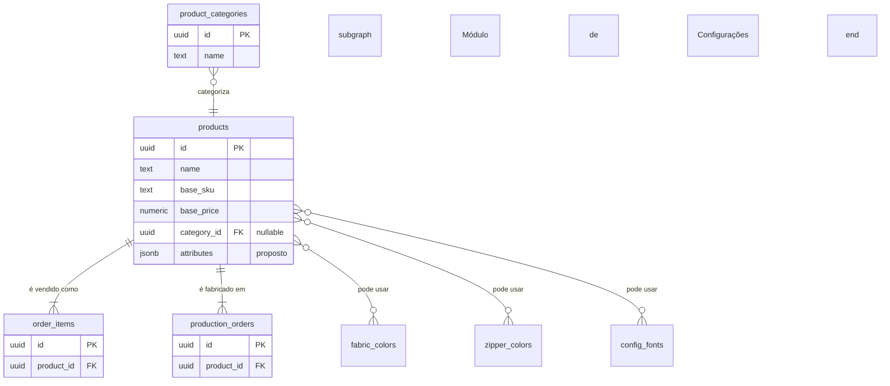
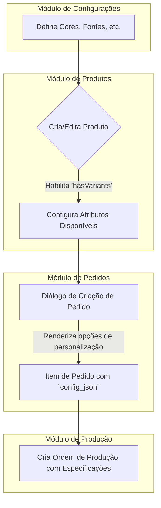

# Documentação Técnica do Módulo: Produtos (Catálogo) v3.0

**Versão:** 3.0 (Implantação Base)
**Data:** 2024-07-31
**Responsável:** 🧠 ArquitetoSupremo (Crew-Gemini)
**Arquivo Fonte:** `/reports/products_v3_diff.md`

---

## 1. Visão Geral

O Módulo de Produtos é o coração do catálogo do Olie Hub. Ele funciona como a fonte única da verdade para todos os itens que podem ser vendidos, produzidos e gerenciados no estoque. Este módulo não apenas define os produtos base, mas também gerencia suas complexas regras de personalização e variação, como cores, bordados e outros atributos, servindo de base para os módulos de Vendas, Produção e Marketing.

-   **Objetivo Operacional:** Manter um catálogo de produtos preciso e centralizado, permitir a configuração flexível de variantes e personalizações, e fornecer dados de produtos consistentes para todos os outros sistemas da plataforma.
-   **Papéis Envolvidos:**
    -   `AdminGeral` / `Administrativo`: CRUD completo sobre o catálogo de produtos.
    -   `Vendas`: Consulta de produtos para criação de pedidos e orçamentos.
    -   `Producao`: Consulta de especificações de produtos para planejamento de produção.

---

## 2. Estrutura de Dados

A arquitetura de dados da v3.0 revela uma estratégia de desenvolvimento "UI-first", onde a aplicação foi construída com base em um tipo de dados (`Product` em `types.ts`) mais rico do que o schema atual do banco de dados.

### Tabelas Principais (Schema Ativo)

| Tabela | Descrição |
| :--- | :--- |
| `products`| Tabela central que armazena os dados do produto base. |

### Tabelas Planejadas / Usadas no Sandbox
| Tabela | Descrição |
| :--- | :--- |
| `product_categories`| Tabela para categorizar produtos. **Não existe no schema de produção**, mas é referenciada no código. |

### Campos-Chave (`products`) e Discrepâncias

A tabela `products` no banco de dados armazena as informações do produto "base", enquanto a lógica de variantes é gerenciada na aplicação.

| Coluna (DB Schema) | Tipo (DB) | Campo (`Product` type) | Descrição e Análise |
| :--- | :--- | :--- | :--- |
| `id` | `uuid` | `id` | Chave primária. |
| `name` | `text` | `name` | Nome do produto. |
| `base_sku` | `text` | `base_sku`| SKU do produto base. |
| `base_price` | `numeric`| `base_price`| Preço inicial antes de personalizações. |
| `category` | `text` | `category`| **Ponto de Atenção:** Categoria como texto livre. A UI espera uma tabela `product_categories`. |
| *N/A* | - | `hasVariants`| **Lógica na Aplicação:** Campo booleano no `types.ts` que controla a exibição do `ProductConfigurator`, mas não existe como coluna no DB. |
| *N/A* | - | `attributes`| **Lógica na Aplicação:** Objeto que armazena as regras de variação (ex: `fabricColor: ['id1', 'id2']`). Não existe como coluna; a estratégia de persistência precisa ser definida. |
| *N/A* | - | `stock_quantity`| **Lógica na Aplicação:** Campo presente no tipo, mas o controle de estoque real deve ser feito no Módulo de Estoque. |

### Diagrama de Relacionamento (ERD) Proposto

---

## 3. Regras de Negócio & RLS

### Políticas de Acesso (RLS)
| Papel | Permissões em `products` |
| :--- | :--- |
| `AdminGeral` / `Administrativo` | CRUD completo. |
| `Vendas`, `Producao`, `Financeiro`| Acesso de leitura (`SELECT`). |

### Lógica Central
-   **Configuração de Variantes:** A lógica principal reside no `ProductDialog` e `ProductConfigurator`. O administrador utiliza o flag `hasVariants` para habilitar a configuração de atributos.
-   **Seleção de Atributos:** O `ProductConfigurator` lê os catálogos do Módulo de Configurações (ex: `fabric_colors`, `zipper_colors`) e permite que o admin selecione quais opções estão disponíveis para um determinado produto.
-   **Persistência de Atributos:** Atualmente, a seleção de atributos (`attributes`) existe apenas no estado do componente. Para ser persistente, ela precisa ser salva no banco de dados, idealmente em uma coluna `jsonb` na tabela `products`.

---

## 4. Fluxos Operacionais

O Módulo de Produtos é o ponto de partida para os fluxos de venda e produção.

---

## 5. KPIs & Métricas

| KPI | Descrição |
| :--- | :--- |
| **Time to Market** | Tempo médio para cadastrar e publicar um novo produto. |
| **Completude do Catálogo** | % de produtos com todos os campos essenciais (descrição, imagens, preço) preenchidos. |
| **Índice de Personalização**| % de produtos que oferecem variantes (`hasVariants = true`). |
| **Produtos Mais Vendidos**| Ranking de produtos por volume de vendas (requer integração com Analytics). |

---

## 6. Critérios de Aceite

-   [✅] A UI permite o CRUD completo de produtos base.
-   [✅] A ativação do flag `hasVariants` exibe corretamente o `ProductConfigurator`.
-   [✅] O `ProductConfigurator` carrega e exibe as opções dos catálogos de Configurações.
-   [ ] **Pendente:** As `attributes` de variantes configuradas para um produto são salvas no banco de dados e recarregadas ao editar o produto.
-   [ ] **Pendente:** A criação de um produto com `stock_quantity` inicial gera o registro correspondente em `inventory_balances`.
-   [✅] Produtos criados aparecem como opções selecionáveis no Módulo de Pedidos.

---

## 7. Auditoria Técnica (Diff) - Implantação v3.0

Esta é a primeira implementação formal do Módulo de Produtos, estabelecendo uma base sólida com uma clara separação entre dados base e lógica de configuração.

-   **Análise Comparativa (Schema vs. UI):** A auditoria revela uma implementação "UI-first" inteligente. O frontend foi construído para suportar um sistema de variantes complexo (`ProductConfigurator`), utilizando um tipo `Product` rico em `types.ts`. Enquanto isso, o schema do banco (`products`) permanece simples, focando no produto base. Esta abordagem permitiu o desenvolvimento rápido da UI, mas agora requer que o backend seja atualizado para persistir a configuração de variantes.
-   **Hook Centralizador (`useProducts`):** O hook gerencia eficientemente o estado, carregando não apenas os produtos, mas também os dados de `Settings` necessários para popular o configurador, demonstrando uma boa coesão entre os módulos.
-   **Diagnóstico de Schema:** O hook lida de forma resiliente com a ausência da tabela `product_categories`, retornando um array vazio e permitindo que a UI funcione sem quebrar, embora o dropdown de categorias fique vazio.

---

## 8. Ações Recomendadas / Pendentes

1.  **[ALTA] Persistir Atributos de Variantes:**
    -   **Ação:** Adicionar uma coluna `attributes` do tipo `jsonb` à tabela `public.products`.
    -   **Impacto:** Permitirá salvar as regras de variação (cores, bordado, etc.) para cada produto, tornando a configuração persistente.

2.  **[MÉDIA] Normalizar Categorias:**
    -   **Ação:** Criar a tabela `public.product_categories`. Em seguida, criar um script de migração para popular esta tabela com os valores únicos da coluna `products.category` (texto), e finalmente substituir a coluna de texto por uma `category_id` (FK).
    -   **Impacto:** Garantirá a consistência dos dados de categoria e permitirá o gerenciamento de categorias como uma entidade separada.

3.  **[MÉDIA] Integrar com Estoque na Criação:**
    -   **Ação:** Ao criar um novo produto com `stock_quantity > 0`, o `saveProduct` deve também acionar uma função para criar ou atualizar o registro correspondente em `inventory_balances`.
    -   **Impacto:** Unificará o fluxo de criação de produto com a inicialização de seu controle de estoque.

4.  **[BAIXA] Implementar Gerenciamento de Imagens:**
    -   **Ação:** Integrar o `storageService` para permitir o upload de imagens de produto e salvar as URLs no campo `images`.
    -   **Impacto:** Completará o cadastro visual dos produtos.