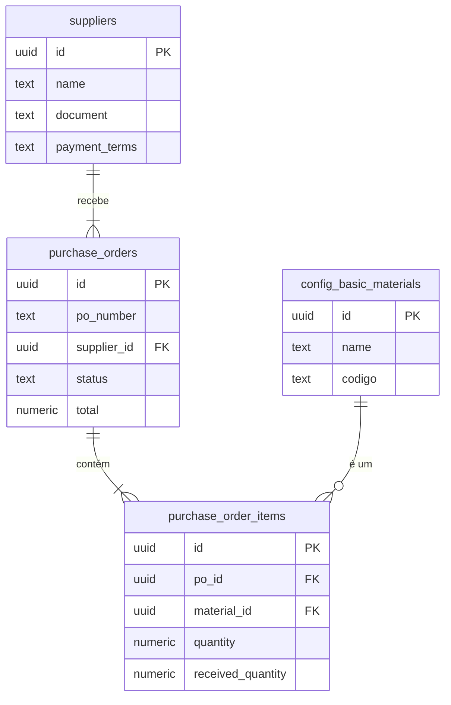
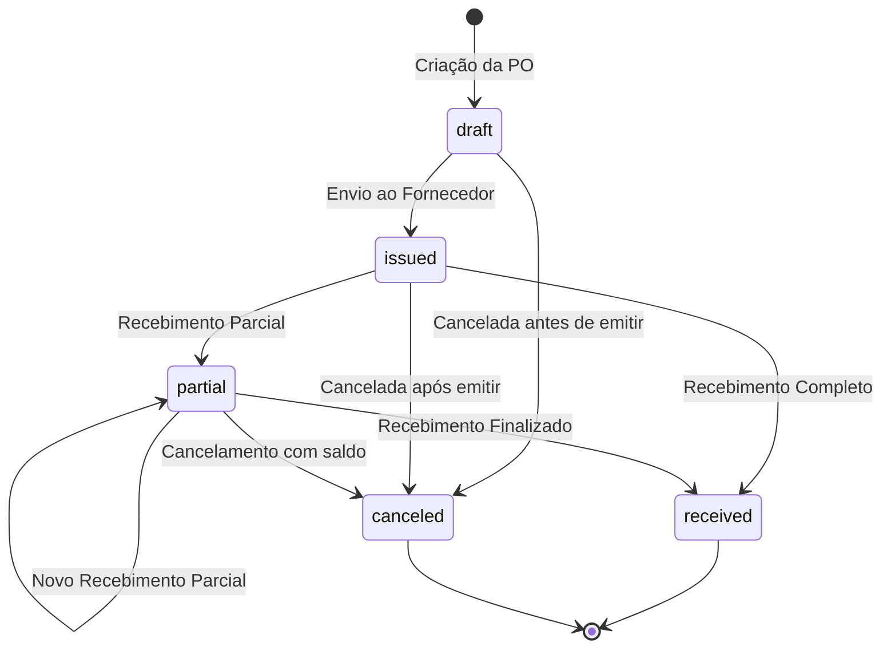

# Documentação Técnica do Módulo: Compras (Purchasing) v3.0

**Versão:** 3.0
**Data:** 2024-07-31
**Responsável:** 🧠 ArquitetoSupremo (Crew-Gemini)
**Arquivo Fonte:** `/reports/purchases_v3_diff.md`

---

## 1. Visão Geral

O Módulo de Compras é o elo estratégico entre o Olie Hub e sua cadeia de suprimentos. Ele é responsável por todo o ciclo de vida da aquisição de materiais, desde o cadastro e avaliação de fornecedores até a criação, emissão e recebimento de Pedidos de Compra (POs - Purchase Orders). Este módulo é a fonte primária de entrada de insumos no sistema, sendo um pré-requisito fundamental para a operação dos módulos de Estoque e Produção.

-   **Objetivo Operacional:** Sistematizar o processo de compra, garantir a rastreabilidade dos materiais recebidos, controlar custos de aquisição, e manter um relacionamento eficiente com os fornecedores.
-   **Papéis Envolvidos:**
    -   `Financeiro`: Gestão de fornecedores, criação e emissão de POs.
    -   `AdminGeral`: Acesso total para supervisão, aprovações e análise de custos.
    -   `Producao`: Consulta de POs para prever a chegada de materiais.

---

## 2. Estrutura de Dados

A arquitetura de dados da v3.0 é normalizada para garantir a integridade do processo de compra e facilitar a integração com outros módulos.

### Tabelas Principais (Schema Ativo no Sandbox)

| Tabela | Descrição |
| :--- | :--- |
| `suppliers` | Tabela central que armazena os dados cadastrais dos fornecedores. |
| `purchase_orders` | Armazena os dados mestre de cada Pedido de Compra. |
| `purchase_order_items`| Itens de material associados a uma PO. |

### Campos-Chave

#### `suppliers`
| Coluna | Tipo | Descrição |
| :--- | :--- | :--- |
| `id` | `uuid` | Chave primária. |
| `name` | `text` | Nome/Razão Social do fornecedor. |
| `document`| `text` | CNPJ ou CPF. |
| `payment_terms` | `text` | Condições de pagamento padrão (ex: '30D'). |
| `lead_time_days`| `integer`| Tempo médio de entrega do fornecedor em dias. |
| `is_active`| `boolean`| Indica se o fornecedor está ativo. |

#### `purchase_orders`
| Coluna | Tipo | Descrição |
| :--- | :--- | :--- |
| `id` | `uuid` | Chave primária. |
| `po_number`| `text` | Número do Pedido de Compra (ex: PC-2024-001). |
| `supplier_id`| `uuid` | Chave estrangeira para `suppliers.id`. |
| `status` | `text` | Status da PO (FSM). Ex: 'draft', 'issued', 'received'. |
| `total` | `numeric`| Valor total da PO. |
| `issued_at`| `timestamptz` | Data em que a PO foi emitida para o fornecedor. |
| `received_at`| `timestamptz` | Data em que o recebimento completo foi confirmado. |

#### `purchase_order_items`
| Coluna | Tipo | Descrição |
| :--- | :--- | :--- |
| `id` | `uuid` | Chave primária. |
| `po_id` | `uuid` | Chave estrangeira para `purchase_orders.id`. |
| `material_id`| `uuid` | Chave estrangeira para `config_basic_materials.id`. |
| `quantity` | `numeric`| Quantidade comprada. |
| `received_quantity` | `numeric`| Quantidade já recebida. |
| `unit_price`| `numeric`| Custo unitário do material. |

### Diagrama de Relacionamento (ERD)



---

## 3. Regras de Negócio & RLS

### Políticas de Acesso (RLS)
| Papel | Permissões em `suppliers`, `purchase_orders`, `purchase_order_items` |
| :--- | :--- |
| `AdminGeral` | CRUD completo. |
| `Financeiro` | `SELECT`, `INSERT`, `UPDATE`. |
| `Producao` | `SELECT` (somente leitura). |

### Máquina de Estados Finitos (FSM) - `purchase_orders.status`
O status de uma PO segue um fluxo claro para garantir controle sobre o processo.



### Triggers (Recomendados)
- **`trigger_inventory_movement_on_reception` (CRÍTICO):** Quando uma PO é recebida (total ou parcialmente), um trigger deve ser acionado para criar um registro em `inventory_movements` com `type='in'` e `reason='compra'`. Esta é a principal integração com o módulo de Estoque.
- **`update_po_total_on_item_change`**: Um trigger que recalcula o campo `total` na `purchase_orders` sempre que um `purchase_order_item` é adicionado, alterado ou removido.
- **`create_financial_payable_on_issue`**: Ao mudar o status para `issued`, um registro deve ser criado na tabela `contas_a_pagar` do módulo Financeiro.

---

## 4. Fluxos Operacionais

O fluxo de compras é o ponto de partida da cadeia de suprimentos interna.

```mermaid
graph TD
    subgraph Módulo de Estoque/Planejamento
        A[Necessidade de Material Detectada]
    end

    subgraph Módulo de Compras
        A --> B{Criação de PO};
        B --"Seleciona Fornecedor e Itens"--> C[PO Status: 'draft'];
        C --"Emite PO"--> D[PO Status: 'issued'];
        D --"Fornecedor Entrega"--> E{Recebimento de Materiais};
        E --"Confirma Quantidades"--> F[PO Status: 'partial' ou 'received'];
    end

    subgraph Módulo de Estoque (DB)
        F --"Trigger"--> G(Cria Movimento de Entrada);
        G --> H[Saldo do Material Aumenta];
    end
    
    subgraph Módulo Financeiro
        D --"Trigger"--> I(Cria Conta a Pagar);
    end

    style G fill:#f9f,stroke:#333
    style I fill:#ccf,stroke:#333
```

---

## 5. KPIs & Métricas

| KPI | Descrição | Meta |
| :--- | :--- | :--- |
| **Purchase Order Cycle Time** | Tempo médio entre `issued_at` e `received_at`. | < Lead Time Acordado |
| **Supplier On-Time Delivery** | % de POs entregues dentro do `expected_delivery_date`. | > 95% |
| **Purchase Price Variance (PPV)** | Variação entre o preço de compra e o custo padrão do material. | < 2% |
| **Total Gasto (Spend)** | Valor total gasto em compras por período/fornecedor. | Monitorar |
| **Taxa de Devolução/Qualidade** | % de materiais recebidos que foram devolvidos por problemas de qualidade. | < 0.5% |

---

## 6. Critérios de Aceite

-   [✅] O CRUD de fornecedores está funcional, com formulário e tabela.
-   [✅] A aba de Pedidos de Compra exibe a lista de POs e um painel de detalhes.
-   [ ] **Pendente:** O diálogo de criação de PO (`CreatePODialog`) está implementado.
-   [ ] **Pendente:** O diálogo de recebimento de materiais (`ReceivePODialog`) está implementado.
-   [ ] **Pendente (CRÍTICO):** O registro de um recebimento de material atualiza automaticamente o saldo em estoque.
-   [ ] **Pendente:** A emissão de uma PO gera o registro financeiro correspondente.

---

## 7. Auditoria Técnica (Diff) - Implantação v3.0

Esta é a primeira implementação formal do Módulo de Compras, estabelecendo a arquitetura base para futuras expansões.

-   **Estrutura da UI:** O módulo foi projetado com uma navegação principal por abas (`Fornecedores`, `Pedidos de Compra`, `Métricas`). A gestão de POs utiliza um layout de duas colunas (lista + painel de detalhes) para uma experiência de usuário eficiente.
-   **Gerenciamento de Estado:** O hook `usePurchasing` centraliza toda a lógica de busca de dados (fornecedores, POs, itens, materiais), gerenciamento de estado (abas, PO selecionada) e mutações (salvar fornecedor).
-   **Resiliência e Diagnóstico:** A lógica de carregamento de dados no hook é resiliente. Ela verifica se cada uma das tabelas (`suppliers`, `purchase_orders`, etc.) foi carregada com sucesso e emite logs no console, informando quais tabelas estão ausentes no schema de produção. Isso garante que a aplicação não quebre e facilita a migração.
-   **Componentes de Ação (Placeholders):** Os componentes para as ações mais complexas (`CreatePODialog`, `ReceivePODialog`) foram criados como placeholders, permitindo que a estrutura geral da UI fosse finalizada enquanto a lógica de negócio detalhada ainda está em desenvolvimento.

---

## 8. Ações Recomendadas / Pendentes

1.  **[ALTA] Migrar Schema Base:** Criar as tabelas `public.suppliers`, `public.purchase_orders`, e `public.purchase_order_items` no Supabase de produção.
2.  **[ALTA] Implementar Diálogos de Ação:** Desenvolver a lógica e a UI dos componentes `CreatePODialog` e `ReceivePODialog`.
3.  **[MÉDIA] Implementar Integração com Estoque:** Conectar a ação de "receber materiais" à criação de um `inventory_movement`. Esta é a funcionalidade mais crítica para a integridade do sistema.
4.  **[MÉDIA] Implementar Integração com Financeiro:** Desenvolver o trigger ou a lógica para criar uma conta a pagar quando uma PO é emitida.
5.  **[BAIXA] Desenvolver Aba de Métricas:** Implementar os gráficos e KPIs no componente `PurchaseMetrics`.
