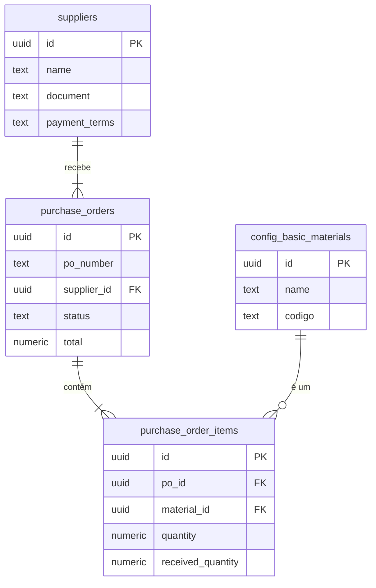

# Documentação Técnica do Módulo: Compras (Purchasing) v3.0

**Versão:** 3.0
**Data:** 2024-07-31
**Responsável:** 🧠 ArquitetoSupremo (Crew-Gemini)
**Arquivo Fonte:** `/reports/purchases_v3_diff.md`

---

## 1. Visão Geral

O Módulo de Compras é o elo estratégico entre o Olie Hub e sua cadeia de suprimentos. Ele é responsável por todo o ciclo de vida da aquisição de materiais, desde o cadastro e avaliação de fornecedores até a criação, emissão e recebimento de Pedidos de Compra (POs - Purchase Orders). Este módulo é a fonte primária de entrada de insumos no sistema, sendo um pré-requisito fundamental para a operação dos módulos de Estoque e Produção.

-   **Objetivo Operacional:** Sistematizar o processo de compra, garantir a rastreabilidade dos materiais recebidos, controlar custos de aquisição, e manter um relacionamento eficiente com os fornecedores.
-   **Papéis Envolvidos:**
    -   `Financeiro`: Gestão de fornecedores, criação e emissão de POs.
    -   `AdminGeral`: Acesso total para supervisão, aprovações e análise de custos.
    -   `Producao`: Consulta de POs para prever a chegada de materiais.

---

## 2. Estrutura de Dados

A arquitetura de dados da v3.0 é normalizada para garantir a integridade do processo de compra e facilitar a integração com outros módulos.

### Tabelas Principais (Schema Ativo no Sandbox)

| Tabela | Descrição |
| :--- | :--- |
| `suppliers` | Tabela central que armazena os dados cadastrais dos fornecedores. |
| `purchase_orders` | Armazena os dados mestre de cada Pedido de Compra. |
| `purchase_order_items`| Itens de material associados a uma PO. |

### Campos-Chave

#### `suppliers`
| Coluna | Tipo | Descrição |
| :--- | :--- | :--- |
| `id` | `uuid` | Chave primária. |
| `name` | `text` | Nome/Razão Social do fornecedor. |
| `document`| `text` | CNPJ ou CPF. |
| `payment_terms` | `text` | Condições de pagamento padrão (ex: '30D'). |
| `lead_time_days`| `integer`| Tempo médio de entrega do fornecedor em dias. |
| `is_active`| `boolean`| Indica se o fornecedor está ativo. |

#### `purchase_orders`
| Coluna | Tipo | Descrição |
| :--- | :--- | :--- |
| `id` | `uuid` | Chave primária. |
| `po_number`| `text` | Número do Pedido de Compra (ex: PC-2024-001). |
| `supplier_id`| `uuid` | Chave estrangeira para `suppliers.id`. |
| `status` | `text` | Status da PO (FSM). Ex: 'draft', 'issued', 'received'. |
| `total` | `numeric`| Valor total da PO. |
| `issued_at`| `timestamptz` | Data em que a PO foi emitida para o fornecedor. |
| `received_at`| `timestamptz` | Data em que o recebimento completo foi confirmado. |

#### `purchase_order_items`
| Coluna | Tipo | Descrição |
| :--- | :--- | :--- |
| `id` | `uuid` | Chave primária. |
| `po_id` | `uuid` | Chave estrangeira para `purchase_orders.id`. |
| `material_id`| `uuid` | Chave estrangeira para `config_basic_materials.id`. |
| `quantity` | `numeric`| Quantidade comprada. |
| `received_quantity` | `numeric`| Quantidade já recebida. |
| `unit_price`| `numeric`| Custo unitário do material. |

### Diagrama de Relacionamento (ERD)



---

## 3. Regras de Negócio & RLS

### Políticas de Acesso (RLS)
| Papel | Permissões em `suppliers`, `purchase_orders`, `purchase_order_items` |
| :--- | :--- |
| `AdminGeral` | CRUD completo. |
| `Financeiro` | `SELECT`, `INSERT`, `UPDATE`. |
| `Producao` | `SELECT` (somente leitura). |

### Máquina de Estados Finitos (FSM) - `purchase_orders.status`
O status de uma PO segue um fluxo claro para garantir controle sobre o processo.

```mermaid
stateDiagram-v2
    [*] --> draft: Criação da PO
    draft --> issued: Envio ao Fornecedor
    draft --> canceled: Cancelada antes de emitir

    issued --> partial: Recebimento Parcial
    issued --> received: Recebimento