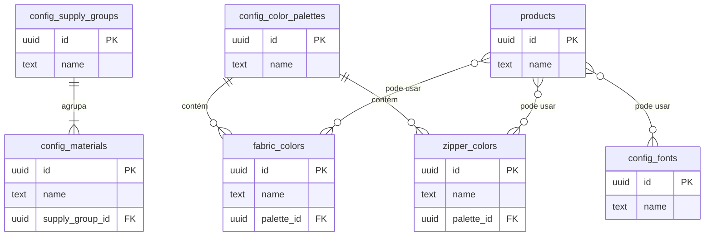
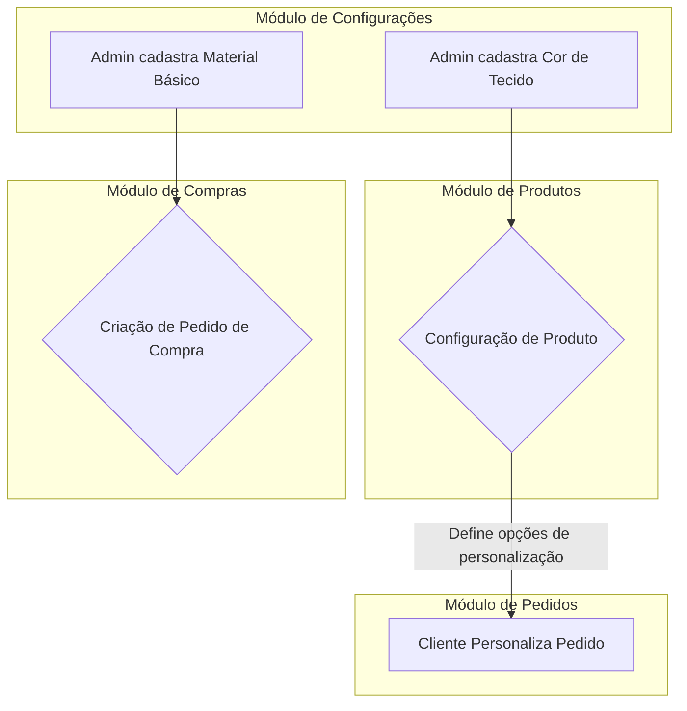

# Documentação Técnica do Módulo: Configurações (Settings) v3.0

**Versão:** 3.0 (Consolidada)
**Data:** 2024-07-31
**Responsável:** 🧠 ArquitetoSupremo (Crew-Gemini)
**Arquivo Fonte:** `/reports/settings_v3_diff.md`

---

## 1. Visão Geral

O Módulo de Configurações é o "cérebro" do Olie Hub, servindo como o repositório central para todos os dados mestres que governam a operação da plataforma. Ele é responsável por gerenciar catálogos de personalização (cores, fontes), insumos de produção (materiais, grupos), parâmetros do sistema, e o status das integrações. Os dados aqui definidos são consumidos por quase todos os outros módulos, garantindo consistência e padronização em todo o ecossistema.

-   **Objetivo Operacional:** Centralizar a gestão de dados-base, permitir a personalização de produtos, controlar a lista de materiais disponíveis para compra e produção, e configurar parâmetros globais do sistema sem a necessidade de alterações no código.
-   **Papéis Envolvidos:**
    -   `AdminGeral`: Acesso total para gerenciar todas as configurações.
    -   `Administrativo`: Permissões para gerenciar catálogos e materiais.

---

## 2. Estrutura de Dados

A arquitetura de dados da v3.0 é modular e projetada para "progressive enhancement". A aplicação é construída para suportar um schema completo, mas permanece funcional mesmo que algumas tabelas ainda não existam, exibindo placeholders informativos.

### Tabelas Principais (Schema Ativo no Sandbox)

| Tabela | Descrição |
| :--- | :--- |
| `config_materials`| Catálogo de todos os insumos e materiais básicos. |
| `config_supply_groups`| Categorias para os materiais básicos (ex: "Tecidos", "Metais"). |
| `config_fonts` | Catálogo de fontes para monogramas e bordados. |
| `fabric_colors`| Catálogo de cores de tecido disponíveis. |
| `zipper_colors`| Catálogo de cores de zíper disponíveis. |
| `bias_colors` | Catálogo de cores de viés disponíveis. |

### Tabelas Planejadas (Não existentes no Schema atual, mas esperadas pela UI)

| Tabela | Módulo | Descrição |
| :--- | :--- | :--- |
| `config_color_palettes`| Catálogos | Agrupador de cores (ex: "Coleção Verão 2025"). |
| `lining_colors`, `puller_colors`, etc. | Catálogos | Demais catálogos de cores e texturas. |
| `system_settings` | Sistema | Tabela Key-Value para parâmetros globais (frete, etc.). |
| `media_assets` | Aparência| Tabela para gerenciar a biblioteca de mídias. |

### Diagrama de Relacionamento (ERD) Proposto

---

## 3. Regras de Negócio & RLS

### Políticas de Acesso (RLS)
| Papel | Permissões em `config_*`, `fabric_colors`, etc. |
| :--- | :--- |
| `AdminGeral` | CRUD completo. |
| `Administrativo`| CRUD completo. |
| Outros | `SELECT` (somente leitura). |

### Lógica Central
-   **Cascata de Ativação:** Um item de configuração (ex: cor de tecido) só pode ser utilizado em outros módulos se seu status (`is_active`) for `true`.
-   **Resiliência de Dados:** O `dataService` foi projetado para não falhar se uma tabela de configuração não existir. Em vez disso, ele retorna um array vazio (`[]`) e emite um `console.warn`, permitindo que a UI exiba um placeholder (`PlaceholderContent`) em vez de quebrar a aplicação.

---

## 4. Fluxos Operacionais

O Módulo de Configurações atua como um provedor de dados para outros fluxos.

---

## 5. KPIs & Métricas

| KPI | Descrição |
| :--- | :--- |
| **Completude do Catálogo** | % de produtos/materiais com todos os campos-chave preenchidos. |
| **Itens Ativos vs. Inativos** | Relação entre o número de configurações ativas e inativas. |
| **Data da Última Atualização** | Rastrear a data da última modificação em configurações críticas (ex: `system_settings`). |

---

## 6. Critérios de Aceite

-   [✅] Apenas usuários com papel `AdminGeral` ou `Administrativo` podem realizar operações de escrita (CRUD).
-   [✅] As operações de CRUD para as tabelas existentes (`config_fonts`, `fabric_colors`, etc.) estão funcionando.
-   [✅] A UI exibe um placeholder informativo (`PlaceholderContent`) para cada seção cuja tabela correspondente não existe no banco.
-   [✅] O upload de arquivos (ex: fontes) funciona no modo sandbox.
-   [ ] **Pendente:** O `system_settings` pode ser editado e salvo, impactando o comportamento de outros módulos (ex: cálculo de frete).

---

## 7. Auditoria Técnica (Diff) - Consolidação v3.0

A v3.0 do Módulo de Configurações é o resultado da fusão das visões das versões anteriores, adotando a arquitetura de dados mais completa e implementando uma estratégia de **progressive enhancement**.

| Característica | Análise da v3.0 |
| :--- | :--- |
| **Escopo de Dados** | Adotou o escopo expandido (16+ tabelas), cobrindo Catálogos, Materiais, Logística, Sistema, Aparência e Segurança. |
| **Interface do Usuário**| Uma UI aninhada (abas principais -> sub-abas verticais -> sub-abas horizontais) foi implementada para organizar a complexidade. |
| **Resiliência** | **Principal Inovação:** O hook `useSettings` e o `dataService` trabalham juntos. O serviço tenta carregar todas as tabelas esperadas; se uma falhar (por não existir), ele retorna um array vazio. O componente `SettingsPage` então renderiza um `PlaceholderContent` em vez do gerenciador `TabContent`, informando ao admin qual tabela precisa ser criada. |
| **Componente de Gestão**| O `TabContent.tsx` foi consolidado como o componente genérico para CRUD, agora com suporte a uploads de arquivo via `storageService`. |
| **Estado Atual** | O módulo está funcional para as tabelas que existem no schema do sandbox e pronto para "ativar" novas seções à medida que o schema do banco de dados evolui, sem necessidade de alterações no frontend. |

Esta abordagem permitiu o desenvolvimento de uma UI completa e robusta, enquanto fornece um guia claro para as migrações de banco de dados necessárias.

---

## 8. Ações Recomendadas / Pendentes

1.  **[ALTA] Migrar Schemas Prioritários:** Criar as tabelas `public.system_settings` e `public.config_supply_groups` no Supabase de produção, pois elas são fundamentais para a configuração do sistema e a organização dos materiais.
2.  **[MÉDIA] Migrar Schemas de Catálogo:** Criar as tabelas restantes de cores e texturas (`config_color_palettes`, `lining_colors`, etc.) para habilitar a personalização completa dos produtos.
3.  **[MÉDIA] Implementar Integração com Supabase Storage:** Desenvolver a lógica no `storageService.ts` para conectar o upload de arquivos (fontes, imagens de mídia) ao Supabase Storage, substituindo o mock do `storageSandbox.ts`.
4.  **[BAIXA] Desenvolver UI de Logística:** Implementar a UI para gerenciar os dados das tabelas de configuração de logística, que atualmente são apenas placeholders.
